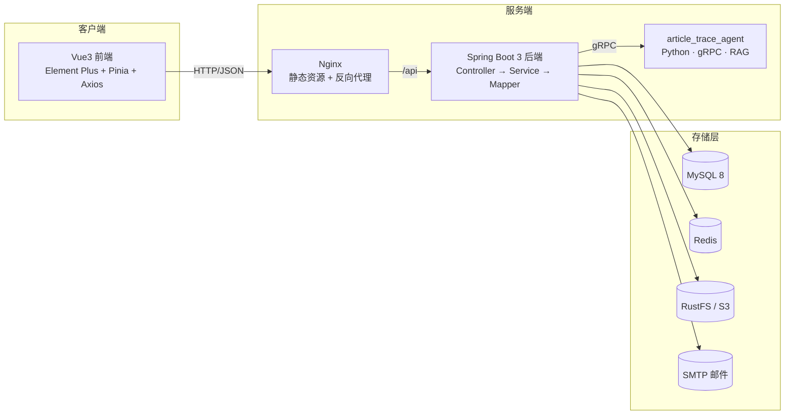

<div align="center">


# 文迹 · Article Trace

一个基于 **Spring Boot 3 + Vue 3** 的前后端分离式 Web 文章平台，另附独立的 **Python RAG 检索问答微服务**

</div>

## 项目简介

**文迹（Article Trace）** 面向 **读者、作者、站长** 三类用户，涵盖文章分类、撰写发布、审核、阅览、评论、账号与通知体系，并接入独立的 AI 检索问答服务。系统基于黑马程序员 Web 教程大幅修改优化。

### 用户角色

| 角色 | type 值 | 权限说明 |
|---|---|---|
| 站长（管理员） | `0` | 全站文章审核、作者申请审批、用户身份管理、删除任意文章/评论 |
| 作者（写手） | `1` | 撰写、编辑、删除自己的文章，管理自己的分类 |
| 读者 | `2` | 浏览文章、发表评论、管理个人信息 |

> 注册一律为**读者**；想要发文需在「申请成为作者」页提交申请，由站长审批通过后自动提权，并强制重新登录以刷新身份。

### 文章状态机

`0` 草稿 ｜ `1` 已发布 ｜ `2` 待审核 ｜ `3` 已驳回

转移规则由**服务端强制**（`ArticleService.canTransfer`）；请求体里的 `state` 只被当作「草稿 / 提交」的意图，具体目标状态由角色决定：

| 从 → 到 | 允许的角色 | 含义 |
|---|---|---|
| `0` → `0` | 不限 | 草稿再次保存 |
| `0` / `3` → `2` | 不限 | 送审 / 修改后重投 |
| `1` → `2` | 不限 | 发布后修改，重新送审 |
| `2` → `2` | 不限 | 待审稿件再次提交 |
| `1` / `2` / `3` → `0` | 不限 | 下架 / 撤回为草稿 |
| `0` → `1` | **仅站长** | 站长发布自己的草稿 |
| `2` → `1`、`2` → `3` | **仅站长** | 审核通过 / 驳回 |
| `1` → `3` | **仅站长** | 误审后追回 |

> 目标为 `0`（草稿）或 `2`（送审）时**不限制角色**，作者与站长都能做；只有「直接置为已发布 `1`」和「驳回 `3`」才要求站长身份。
>
> **作者无法把文章直接置为已发布**——这一点由后端强制，不依赖前端按钮。非法流转（如 `3 → 1`、`state=99`）一律拒绝。

## 功能特性

**账号与安全**

- **注册 / 找回密码**：均走**邮箱验证码**（6 位、5 分钟有效、一次性），注册时校验邮箱唯一。注册无需填写昵称，后端会自动生成一个（`文迹探索者` + 6 位随机串）。
- **人机校验（图形验证码）**：获取邮箱验证码前需通过图形验证码。注册/找回密码采用**弹窗式**，与表单校验彻底解耦；登录侧的图形码则内联在表单里（服务端在登录请求中校验）。
- **登录防爆破**：按「IP + User-Agent」指纹计数，失败 3 次要求图形验证码、10 次锁定 5 分钟；计数 15 分钟固定窗口，登录成功立即清零。
- **鉴权**：JWT + Redis 双校验，BCrypt 加密，改密后旧登录态立即失效。

**内容体系**

- **文章**：富文本撰写、封面上传；作者可**存草稿**或**送审**，站长审核通过才置为已发布（驳回可修改后重投）。标题在同一作者内唯一。
- **分类**：作者自定义分类，读者按分类浏览。
- **评论**：登录评论 + 敏感词校验 + 分级删除。
- **敏感词过滤**：Aho-Corasick 多模式匹配，外部词库 30 分钟热更新。
- **浏览量统计**：Redis 缓冲累加 + 定时同步 MySQL + 热门 Top10 缓存。
- **对象存储**：图片与内容 JSON 分桶存于 RustFS（S3 兼容），列表页走缩略图。

**通知与运营**

- **站内信 + 邮件**：统一的 `NotificationService` 门面，按场景配置渠道（站内 / 邮件 / 两者）。邮件**先落库再异步投递**，失败自动重试（上限 2 次）；站内信 30 天自动清理。
- **作者申请**：读者提交 → 通知站长 → 审批提权 → 通知申请人；每 12 小时检查一次待审积压并邮件提醒站长（`author-apply.remindCron`）。
- **AI 检索问答**：独立的 Python RAG 微服务（gRPC 契约），支持文章索引增量/全量同步与多轮会话；Java 侧有总开关，关闭时整体降级、不影响主服务。

## 技术栈

- **后端**：Spring Boot 3.5 · Java 21 · MyBatis-Plus · MySQL 8 · Redis · RustFS(S3) · JWT · BCrypt · Spring Mail · easy-captcha · jsoup · gRPC / Protobuf
- **前端**：Vue 3.5 · Vite 7 · Element Plus · Pinia · Vue Router · Axios · Vue-Quill · Sass
- **AI 服务**：Python · gRPC · 双路召回（dense + sparse）+ RRF 融合 · LLM 生成
- **部署**：Docker Compose（后端 + 前端 Nginx + agent）

## 项目结构

```
article_trace/
├── article_trace_back/          # Spring Boot 后端           → 详见 article_trace_back/README.md
├── article_trace_front/         # Vue 3 前端                → 详见 article_trace_front/README.md
├── article_trace_agent/         # RAG 检索问答微服务（Python）→ 详见 article_trace_agent/README.md
├── docker/                      # 各服务的容器化配置
├── docker-compose.yml           # 一键编排
├── article_trace.sql            # MySQL 建库脚本（7 张表，纯 schema）
├── .env.example                 # 部署环境变量模板
├── README.md                    # 本文件（项目总览）
└── LICENSE
```

> 各子项目的技术细节、目录结构、模块实现、部署方式均在各子目录的 `README.md` 中，本文件只做总览。

## 平台架构



## 快速开始

完整的环境准备、配置与启动步骤见各子项目文档：

- 后端：[article_trace_back/README.md](article_trace_back/README.md)
- 前端：[article_trace_front/README.md](article_trace_front/README.md)
- AI 服务：[article_trace_agent/README.md](article_trace_agent/README.md)

简版流程：

```bash
# 1. 初始化数据库（脚本自带 CREATE DATABASE / USE）
mysql -uroot -p < article_trace.sql

# 2. 启动后端
cd article_trace_back
# 将 application_templete.yml 复制为 application.yml，按注释填写（配置支持 ${ENV} 占位）
mvn spring-boot:run

# 3. 启动前端
cd article_trace_front
npm install        # 或 bun install
npm run dev        # Vite 代理 /api → localhost:8080

# 4.（可选）启动 AI 检索问答服务
cd article_trace_agent
# 独立进程，详见该目录 README；Java 侧通过 rpc.agent.enabled 控制是否启用
```

### Docker 部署

```bash
cp .env.example .env    # 填写数据库 / Redis / SMTP / RustFS 等凭据
docker compose up -d
```

## 项目展示

<div align="center">

  登录界面


  首页


  后台首页
</div>

---

*基于黑马程序员 Web 教程大幅修改优化。*
