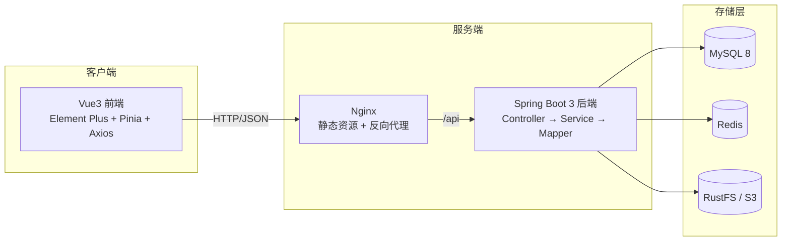

<div align="center">


# 文迹 · Article Trace

一个基于 **Spring Boot 3 + Vue 3** 的前后端分离式 Web 文章平台

</div>

## 项目简介

**文迹（Article Trace）** 是面向 **读者、作者、站长** 三类用户的前后端分离式 Web 文章平台，涵盖文章分类、撰写发布、审核、阅览、评论、账号管理等完整功能。系统基于黑马程序员 Web 教程大幅修改优化。

### 用户角色

| 角色 | type 值 | 权限说明 |
|---|---|---|
| 站长（管理员） | `0` | 全站文章审核、用户身份管理、删除任意文章/评论 |
| 作者（写手） | `1` | 撰写、编辑、删除自己的文章，管理自己的分类 |
| 读者 | `2` | 浏览文章、发表评论、管理个人信息 |

### 文章状态机

`0` 草稿 ｜ `1` 已发布 ｜ `2` 待审核 ｜ `3` 已驳回

## 功能特性

- **用户体系**：注册、登录（JWT + Redis 双校验）、忘记密码、个人信息与头像维护。
- **文章体系**：富文本撰写、封面上传、草稿/发布、站长审核与驳回。
- **分类体系**：作者自定义分类，读者按分类浏览。
- **评论体系**：登录评论 + 敏感词校验 + 分级删除。
- **敏感词过滤**：Aho-Corasick 多模式匹配，外部词库 30 分钟热更新。
- **浏览量统计**：Redis 缓冲累加 + 定时同步 MySQL + 热门 Top10 缓存。
- **对象存储**：图片与内容 JSON 分桶存于 RustFS（S3 兼容）。
- **安全防护**：BCrypt 加密、JWT 鉴权、ThreadLocal 上下文、全局异常捕获。

## 技术栈

- **后端**：Spring Boot 3.5 · Java 21 · MyBatis-Plus · MySQL · Redis · RustFS(S3) · JWT · BCrypt · jsoup
- **前端**：Vue 3.5 · Vite 7 · Element Plus · Pinia · Vue Router · Axios · Vue-Quill · Sass

## 项目结构

```
article_trace/
├── article_trace_back/          # Spring Boot 后端      → 详见 article_trace_back/README.md
├── article_trace_front/         # Vue 3 前端           → 详见 article_trace_front/README.md
├── article_trace_agent/         # RAG 检索增强服务（Python，独立维护）
├── article_trace.sql            # MySQL 建库脚本（4 张表）
├── README.md                    # 本文件（项目总览）
├── LICENSE
└── .gitignore
```

> 各子项目的技术细节、目录结构、模块实现、部署方式均在各子目录的 `README.md` 中，本文件只做总览。

## 平台架构



## 快速开始

完整的环境准备、配置与启动步骤见各子项目文档：

- 后端：[article_trace_back/README.md](article_trace_back/README.md)
- 前端：[article_trace_front/README.md](article_trace_front/README.md)

简版流程：

```bash
# 后端
cd article_trace_back
# 1. source article_trace.sql 初始化数据库
# 2. 复制 application_templete.yml 为 application.yml 并填写配置
mvn spring-boot:run

# 前端
cd article_trace_front
npm install        # 或 bun install
npm run dev        # Vite 代理 /api → localhost:8080
```

## 项目展示

<div align="center">

  登录界面


  首页


  后台首页
</div>

---

*基于黑马程序员 Web 教程大幅修改优化。*
