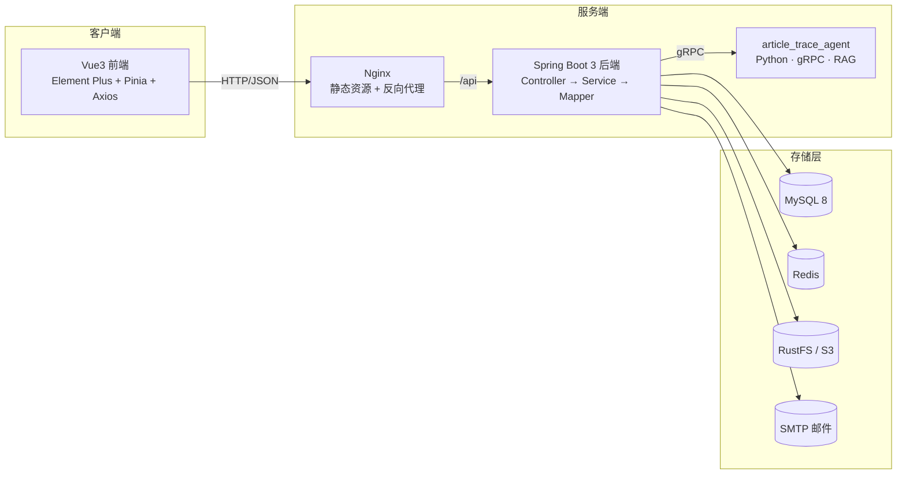

<div align="center">


# 文迹 · Article Trace

一个基于 **Spring Boot 3 + Vue 3** 的前后端分离式 Web 文章平台，另附独立的 **Python RAG 检索问答微服务**

</div>

## 项目简介

**文迹（Article Trace）** 面向 **读者、作者、站长** 三类用户，涵盖文章分类、撰写发布、审核、阅览、评论、账号与通知体系，并接入独立的 AI 检索问答服务。系统基于黑马程序员 Web 教程大幅修改优化。

### 用户角色

| 角色 | type 值 | 权限说明 |
|---|---|---|
| 站长（管理员） | `0` | 全站文章审核、作者申请审批、头像审核、用户身份管理、删除任意文章/评论 |
| 作者（写手） | `1` | 撰写、编辑、删除自己的文章，管理自己的分类 |
| 读者 | `2` | 浏览文章、发表评论、管理个人信息 |

> 注册一律为**读者**；想要发文需在「申请成为作者」页提交申请，由站长审批通过后自动提权，并强制重新登录以刷新身份。

### 文章状态机

`0` 草稿 ｜ `1` 已发布 ｜ `2` 待审核 ｜ `3` 已驳回

转移规则由**服务端强制**（`ArticleService.canTransfer`）；请求体里的 `state` 只被当作「草稿 / 提交」的意图，具体目标状态由角色决定：

| 从 → 到 | 允许的角色 | 含义 |
|---|---|---|
| `0` → `0` | 不限 | 草稿再次保存 |
| `0` / `3` → `2` | 不限 | 送审 / 修改后重投 |
| `1` → `2` | 不限 | 发布后修改，重新送审 |
| `1` → `1` | **仅站长** | 发布后修改，**仍保持已发布**（站长走这条；作者走上一行走重新送审）|
| `2` → `2` | 不限 | 待审稿件再次提交 |
| `1` / `2` / `3` → `0` | 不限 | 下架 / 撤回为草稿 |
| `0` → `1` | **仅站长** | 站长发布自己的草稿 |
| `2` → `1`、`2` → `3` | **仅站长** | 审核通过 / 驳回 |
| `1` → `3` | **仅站长** | 误审后追回 |

> 目标为 `0`（草稿）或 `2`（送审）时**不限制角色**，作者与站长都能做；只有「直接置为已发布 `1`」和「驳回 `3`」才要求站长身份。
>
> **作者无法把文章直接置为已发布**——这一点由后端强制，不依赖前端按钮。非法流转（如 `3 → 1`、`state=99`）一律拒绝。
>
> **命中违禁词的文章不被驳回，而是落入待审**：标题或正文命中违禁词时，目标状态强制为 `2`，并打上「已命中」标记、记录命中的词；审核列表筛「待审核」时这些稿件排在最前。**站长自己发布同样走待审**——他是唯一能改词库的人，只有让命中结果落进他能看见的队列，误伤才能反馈回词表。命中词只对站长可见，作者侧看不到任何「命中」痕迹。

## 功能特性

**账号与安全**

- **注册 / 找回密码**：均走**邮箱验证码**（6 位、5 分钟有效、一次性），注册时校验邮箱唯一。注册无需填写昵称，后端会自动生成一个（`文迹探索者` + 6 位随机串）。验证码**连续输错 5 次即作废并锁定该邮箱 5 分钟**，校验接口另按 IP+UA 限流（30 次/分钟）——否则 6 位码在 5 分钟有效期内能被撞库撞开。
- **人机校验（图形验证码）**：获取邮箱验证码前需通过图形验证码。注册/找回密码采用**弹窗式**，与表单校验彻底解耦；登录侧的图形码则内联在表单里（服务端在登录请求中校验）。
- **登录防爆破**：按「IP + User-Agent」指纹计数，失败 3 次要求图形验证码、10 次锁定 5 分钟；计数 15 分钟固定窗口，登录成功立即清零。
- **鉴权**：JWT + Redis 双校验，BCrypt 加密，改密后旧登录态立即失效。令牌以 **HttpOnly Cookie** 下发（前端不持有，XSS 也偷不走），配合 `SameSite=Lax` 防 CSRF。

**内容体系**

- **文章**：富文本撰写、封面上传；作者可**存草稿**或**送审**，站长审核通过才置为已发布（驳回可修改后重投）。标题在同一作者内唯一。
- **富文本清洗**：正文在**落库与回显两头**都做 jsoup 白名单清洗（保留 `p` / `img` 等排版标签，剥掉脚本、事件属性与 `javascript:` 伪协议），防止存储型 XSS。
- **分类**：作者自定义分类，读者按分类浏览。
- **评论**：登录评论 + 敏感词校验 + 分级删除。
- **敏感词过滤**：Aho-Corasick 多模式匹配，外部词库 30 分钟热更新。文章命中不驳回，改为落入待审并优先审核（见「文章状态机」）。
- **举报**：登录用户可举报**文章 / 评论 / 用户**（理由必填、同一对象只能报一次、不能举报自己），站长在「举报处理」页处置。举报只记「谁报了谁、处理了没有」，**内容本身仍走原有的下架 / 删评论动作**，处置逻辑只有一份。
- **可收敛为单用户态**：`site.*` 一组开关（注册 / 评论 / 作者申请 / 站名 / logo）由 `.env` 驱动，线上做个人备案时一键收敛成个人博客形态，**代码不分叉**。详见后端 README 的「站点功能开关」。
- **浏览量统计**：Redis 缓冲累加 + 定时同步 MySQL + 热门 Top10 缓存。
- **对象存储**：图片与内容 JSON 分桶存于 RustFS（S3 兼容），列表页走缩略图。

**通知与运营**

- **站内信 + 邮件**：统一的 `NotificationService` 门面，按场景配置渠道（站内 / 邮件 / 两者）。邮件**先落库再异步投递**，失败自动重试（上限 2 次）；站内信 30 天自动清理。
- **作者申请**：读者提交 → 通知站长 → 审批提权 → 通知申请人；每 12 小时检查一次待审积压并邮件提醒站长（`author-apply.remindCron`）。
- **AI 检索问答**：独立的 Python RAG 微服务（gRPC 契约），支持文章索引增量/全量同步与多轮会话；Java 侧有总开关，关闭时整体降级、不影响主服务。

## 技术栈

- **后端**：Spring Boot 3.5 · Java 21 · MyBatis-Plus · MySQL 8 · Redis · RustFS(S3) · JWT · BCrypt · Spring Mail · easy-captcha · jsoup · gRPC / Protobuf
- **前端**：Vue 3.5 · Vite 7 · Element Plus · Pinia · Vue Router · Axios · Vue-Quill · Sass
- **AI 服务**：Python · gRPC · 双路召回（dense + sparse）+ RRF 融合 · LLM 生成
- **部署**：Docker Compose（后端 + 前端 Nginx + agent）

## 项目结构

```
article_trace/
├── article_trace_back/          # Spring Boot 后端           → 详见 article_trace_back/README.md
├── article_trace_front/         # Vue 3 前端                → 详见 article_trace_front/README.md
├── article_trace_agent/         # RAG 检索问答微服务（Python）→ 详见 article_trace_agent/README.md
├── scripts/                     # 辅助脚本（init_test_db.py 初始化测试库）
├── docker/                      # 各服务的容器化配置
├── docker-compose.yml           # 一键编排
├── article_trace.sql            # MySQL 建库脚本（8 张表，纯 schema）
├── .env.example                 # 部署环境变量模板
├── README.md                    # 本文件（项目总览）
└── LICENSE
```

> 各子项目的技术细节、目录结构、模块实现、部署方式均在各子目录的 `README.md` 中，本文件只做总览。

## 平台架构



## 快速开始

完整的环境准备、配置与启动步骤见各子项目文档：

- 后端：[article_trace_back/README.md](article_trace_back/README.md)
- 前端：[article_trace_front/README.md](article_trace_front/README.md)
- AI 服务：[article_trace_agent/README.md](article_trace_agent/README.md)

简版流程：

```bash
# 1. 初始化数据库（脚本自带 CREATE DATABASE / USE）
mysql -uroot -p < article_trace.sql

# 2. 启动后端
cd article_trace_back
# 将 application_templete.yml 复制为 application.yml，按注释填写（配置支持 ${ENV} 占位）
mvn spring-boot:run

# 3. 启动前端
cd article_trace_front
npm install        # 或 bun install
npm run dev        # Vite 代理 /api → localhost:8080

# 4.（可选）启动 AI 检索问答服务
cd article_trace_agent
# 独立进程，详见该目录 README；Java 侧通过 rpc.agent.enabled 控制是否启用
```

### Docker 部署（云端）

这套编排面向**服务器部署**。本机开发直接用 IDEA + Vite，不需要起容器。

**两层 nginx，职责不同**：宿主机那层终止 TLS 并按域名分流；容器内那层只负责托管静态资源与转发 `/api`。

```
浏览器 ──https://example.com───────► 宿主机 Nginx :443 ──► 127.0.0.1:8080 ──► 前端容器 :80
                                                                                      │ /api
                                                                                      ▼
                                                                                backend :8080
       ──https://files.example.com─► 宿主机 Nginx :443 ──► 127.0.0.1:9000 ──► RustFS
```

**前置**：一个域名，两条 A 记录（主域 + 对象存储子域）；服务器装 `nginx` 与 `certbot`。

#### 1. 宿主机反向代理

写入 `/etc/nginx/conf.d/article-trace.conf`，把 `example.com` 换成你的域名：

```nginx
# 主站 → 前端容器
server {
    listen 443 ssl;
    http2 on;
    server_name example.com;
    ssl_certificate     /etc/letsencrypt/live/example.com/fullchain.pem;
    ssl_certificate_key /etc/letsencrypt/live/example.com/privkey.pem;
    client_max_body_size 11m;              # 必须大于后端的 max-request-size（10MB），否则刚超限的请求会先被这层拦成裸 413（正文 JSON + 封面走同一个 multipart）

    location / {
        proxy_pass http://127.0.0.1:8080;
        proxy_set_header Host $host;
        proxy_set_header X-Forwarded-For   $proxy_add_x_forwarded_for;
        proxy_set_header X-Forwarded-Proto $scheme;
        # SSE：AI 问答是流式的，不关缓冲打字机效果就没了。逐跳生效，这层也要关
        proxy_buffering off;
        proxy_read_timeout 300s;
        proxy_send_timeout 300s;
    }
}

# 对象存储子域 → RustFS（预签名 URL 是浏览器直接来取的，不经前端）
server {
    listen 443 ssl;
    http2 on;
    server_name files.example.com;
    ssl_certificate     /etc/letsencrypt/live/files.example.com/fullchain.pem;
    ssl_certificate_key /etc/letsencrypt/live/files.example.com/privkey.pem;
    client_max_body_size 3m;

    location / {
        proxy_pass http://127.0.0.1:9000;
        # 必须显式写：nginx 默认传 $proxy_host，而 S3 签名认的是原始 Host
        proxy_set_header Host $http_host;
        proxy_set_header X-Forwarded-For $proxy_add_x_forwarded_for;
    }
}

# 80 只做跳转，顺带给 certbot 验证
server {
    listen 80;
    server_name example.com files.example.com;
    return 301 https://$host$request_uri;
}
```

再申证书——会自动补全上面的 `ssl_certificate` 并装好续期任务：

```bash
certbot --nginx -d example.com -d files.example.com
```

#### 2. `.env` 必填项

除原有凭据外，上云必须再设这四项：

| 变量 | 值 | 不设的后果 |
|---|---|---|
| `RUSTFS_ENDPOINT` | `https://files.example.com` | 图片 URL 里是 Docker 内网名 `rustfs`，浏览器解析不了，**全站图片加载失败** |
| `LLM_BASE_URL` | `http://<Ollama 机器>:11434/v1` | 默认编排不启本地 ollama，agent 会去连一个不存在的服务 |
| `JWT_COOKIE_SECURE` | 上了 HTTPS 后置 `true` | 置 true 却没 HTTPS → Cookie 存不下，登录后一刷新就退出 |
| `MAIL_LOGO_URL` | `https://example.com/logo2.png` | 邮件里 logo 位置裂图 |

#### 2.1 可选：个人备案用的「单用户态」

`.env` 里这三项**全设 false** 即把站点收敛成个人博客形态——不开放注册、不能新增评论、不能申请成为作者，
用于满足个人 ICP 备案口径（个人备案不得涉及企业、团体、论坛）；不设或设 `true` = 多用户态，本地开发即如此。

| 变量 | 默认 | 设为 `false` 的效果 |
|---|---|---|
| `SITE_REGISTER_ENABLED` | `true` | 关闭注册（发验证码接口的 register 场景一并关闭） |
| `SITE_COMMENT_ENABLED` | `true` | 不能新增评论（历史评论照常展示） |
| `SITE_AUTHOR_APPLY_ENABLED` | `true` | 关闭「申请成为作者」 |

前端通过免登录接口 `GET /api/site/features` 读这三个值来隐藏入口，**后端还有一道拒绝**，两层都在才对。
改完 `docker compose up -d backend frontend` 生效（环境变量在容器创建时固化）。

#### 3. 启动

```bash
cp .env.example .env     # 首次必须，凭据缺失时 compose 会直接报错
docker compose up -d --build
```

默认起 7 个服务（mysql / redis / rustfs / rustfs-init / agent / backend / frontend）。

> ⚠️ **只能单实例运行**：项目里有 8 个 `@Scheduled` 任务（邮件重试、通知清理、浏览量落库、敏感词热更、agent 同步等）都**没有分布式锁**，扩到多副本会重复执行。要横向扩容得先引入 ShedLock 之类。
Ollama 归在 `local-llm` profile，两机部署时不在这台起；单机跑全栈用 `--profile local-llm`。

安全组 / 防火墙只放 **80 和 443**。其余端口在 compose 里已绑死 `127.0.0.1`，公网上不会有监听者。

#### 4. 验证顺序

分步测，混在一起排查会很痛苦：

1. 先**不设** `JWT_COOKIE_SECURE`，开 `https://example.com` —— 确认锁标正常、能登录
2. 传一张封面 —— 确认图片显示（这一步验的是 `RUSTFS_ENDPOINT`）
3. 两项都通后，把 `JWT_COOKIE_SECURE` 改 `true`，`docker compose up -d backend`

### 后续更新

```bash
git pull
docker compose up -d --build
```

数据卷不会被动（`mysql-data` / `rustfs-data` / `redis-data` / `agent-data` / `ollama-data`），
`.env` 不在仓库里也不会被覆盖。按改动范围可以收窄重建目标：

| 改了什么 | 命令 |
|---|---|
| 后端 / 前端 / agent 代码 | `docker compose up -d --build backend`（换服务名） |
| 依赖（`pom.xml` / `requirements.txt`） | 必须带 `--build` |
| 挂载的配置（`docker/**/*.yml`、`*.yaml`） | `docker compose up -d <服务>`，**不用** `--build` |
| `.env` | 同上（环境变量在容器创建时固化，必须重建容器） |

> ⚠️ **永远不要带 `-v`**：`docker compose down -v` 会连数据卷一起删掉。

**三处不会自动生效的地方**

1. **数据库结构变更**。`article_trace.sql` 只在 MySQL 数据目录为空时执行（即首次部署）；
   之后改它、`git pull`、重建镜像，数据库里都没有变化，**而且不报错**。加字段/加表要在服务器上手工执行 DDL。
2. **换 embedding 模型**。Chroma 里存量向量是旧模型算的，与新模型不在同一向量空间，
   检索结果会变成垃圾但**不报错**。必须清掉重建：
   ```bash
   docker compose stop agent
   docker compose run --rm --entrypoint sh agent -c "rm -rf /app/data/vector_store"
   docker compose up -d agent
   ```
   然后等全量同步（默认凌晨 1 点，`rpc.agent.sync.fullSyncCron`）重新灌一遍。
3. **存量缩略图补齐**。`thumbnail.backfill.enabled` 默认 `false`，需要时临时置 `true` 重启后端，跑完改回。

**备份与回滚**

```bash
# 更新前备份
docker compose exec mysql sh -c 'mysqldump -uroot -p"$MYSQL_ROOT_PASSWORD" article_trace' > backup-$(date +%F).sql

# 回滚
git checkout <上一个提交> && docker compose up -d --build
```

代码回滚是安全的（数据卷不动），但 **DDL 不回滚**——带结构变更的更新务必先备份数据库。

> 单机部署做不到零停机：重建 backend 时 `/api` 会短暂 502（静态页仍可打开），
> 重建 frontend 时整个站点几秒不可用。小站接受即可。

## 项目展示

<div align="center">

  登录界面


  首页


  后台首页
</div>

---

*基于黑马程序员 Web 教程大幅修改优化。*
