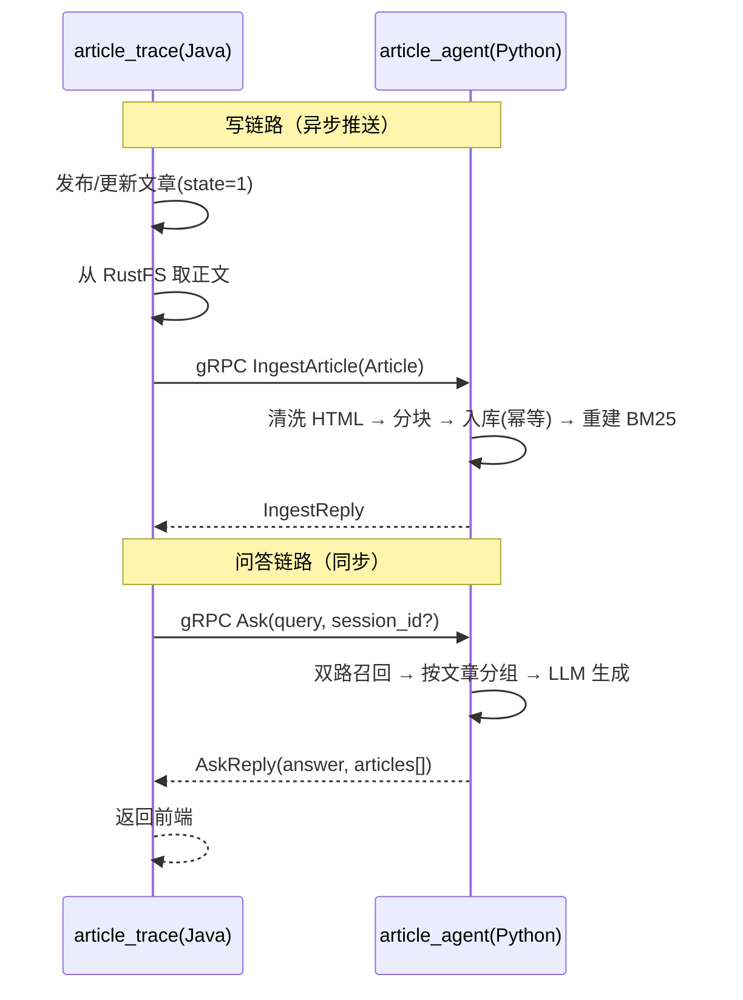

# article_trace_agent

> 为 [article_trace](../) 提供「文章检索 + 生成式问答」能力的独立 Python 微服务。

本服务是一个与主 Java 项目**完全隔离**的 RPC 微服务：不共享任何运行时代码，只通过一份
**gRPC 接口契约（protobuf）** 与 `article_trace` 通信。Java 侧负责文章数据的读写，本服务
只负责「把文章索引起来 + 回答用户问题」。

---

## 定位与隔离原则

| 角色 | 谁 | 职责 |
|------|-----|------|
| 主项目 | `article_trace`（Java, SpringBoot） | 文章增删改查、用户、审核、前端展示 |
| 本服务 | `article_trace_agent`（Python） | 文章检索（双路召回）+ LLM 生成答案 |
| 通信 | gRPC（protobuf 契约） | Java ↔ Python 之间唯一的耦合点 |

- **代码层面无关联**：两边只复制同一份 `proto/article_agent.proto`，各自生成 stub，互不 import。
- **数据只在 Java 侧**：文章正文在 RustFS、元数据在 MySQL；本服务不连数据库，只接收 Java 推送来的内容。

```
┌─────────────────────────┐         gRPC(protobuf)          ┌──────────────────────────┐
│   article_trace (Java)   │  ◄──────────────────────────►  │  article_agent (Python)  │
│  SpringBoot 主应用        │     仅通过 proto 契约通信         │  独立进程 / 独立服务        │
│  ├ 文章发布/更新/删除       │  Ingest / Delete / Ask / Sync  │  ├ gRPC server            │
│  └ RPC Client (stub)     │ ─────────────────────────────► │  ├ 双路召回(dense+sparse)  │
│     读 RustFS 正文 → 推送  │ ◄───────────────────────────── │  ├ RRF 融合               │
│     用户提问 → 取答案      │                               │  └ LLM 生成答案           │
└─────────────────────────┘                               └──────────────────────────┘
```

---

## 技术栈

| 层 | 技术 |
|----|------|
| RPC | gRPC + Protobuf（`grpcio` / `grpcio-tools`） |
| 稠密检索 | ChromaDB（向量库）+ bge-m3 embedding |
| 稀疏检索 | BM25（`rank-bm25`，中文字符级分词） |
| 融合 | RRF（倒数排名融合） |
| 生成模型 | qwen2.5（本地 Ollama，OpenAI 兼容端点） |
| 框架支撑 | langchain（Chroma / OpenAI 兼容封装） |

双路召回 + 基础问答内核抽取自 [clean_robot_agent](../../clean_robot_agent/)，剔除了其中的
意图分类、SOP、售后网点等业务逻辑，只保留「稠密 + 稀疏 → RRF 融合 → LLM 生成」这条主链。

---

## 目录结构

```
article_trace_agent/
├── proto/                     # 接口契约（唯一与 Java 共享，见 proto/README.md）
│   ├── article_agent.proto    # 服务 + 消息定义
│   └── README.md              # 契约说明 + 两端代码生成命令
├── tools/                     # 双路召回内核（已抽取）
│   ├── sparse_retriever.py    # BM25 稀疏检索（含 pickle 缓存）
│   ├── rrf_fusion.py          # RRF 融合（按 chunk_id 去重）
│   ├── llm_tool.py            # LLM / Embedding 工厂（默认 Ollama，可切任意 OpenAI 兼容服务）
│   ├── context_store.py       # 多轮会话上下文（jsonl）
│   ├── html_util.py           # HTML → 纯文本清洗
│   └── path_tool.py / config_tool.py / log_tool.py / prompts_tool.py  # 支撑
├── generated/                 # grpc 生成的 *_pb2.py（生成产物，gitignore）
├── config/                    # agent / rag / chroma / prompts 配置（YAML）
├── prompts/                   # 系统提示词
├── data/                      # 运行时产物：向量库 / pkl / 上下文（gitignore）
└── README.md
```

> 当前 `tools/` 内为已抽取的双路召回内核；文章级入库、问答编排、gRPC server 与配置仍在实现中，
> 进度见文末 [开发进度](#开发进度)。

---

## 接口契约（6 个 RPC 方法）

完整定义见 [proto/article_agent.proto](proto/article_agent.proto)，摘要如下：

| 方法 | 方向 | 作用 |
|------|------|------|
| `IngestArticle` | Java → Python | 单篇推送/覆盖（按 `article.id` 幂等） |
| `BatchIngestArticles` | Java → Python | 批量推送/覆盖 |
| `DeleteArticles` | Java → Python | 删除若干篇（下线/删除时） |
| `SyncArticles` | Java → Python | 全量/增量流式同步（客户端流式） |
| `Ask` | Java ⇄ Python | 检索 + LLM 生成答案，返回 `answer` + 命中文章列表 |
| `Health` | Java → Python | 健康探活 + 入库统计 |

要点：

- 入库**幂等**：按 `article.id` 覆盖，重推不产生重复索引。
- `Article` 消息携带 `category_name / author / cover_url` 等 Java 侧联查好的字段，本服务不回查数据库。
- `MatchedArticle` 只回**摘要片段**，正文由 Java 按 id 从 RustFS 自取，避免大文本来回传。
- 命名空间版本化 `article.agent.v1`，将来不兼容变更走 `v2`。

---

## 检索与问答链路

```
用户提问 (Ask)
  → 稠密检索（Chroma + bge-m3 向量）
  → 稀疏检索（BM25 关键词）
  → RRF 融合去重 → top-k 分块
  → 按 article_id 分组，产出「命中文章列表」
  → 拼装 top 分块 + 对话历史 → LLM 生成答案
  → 返回 { answer, articles[] }
```

---

## 快速开始

> ⚠️ 当前为**开发早期**：契约与检索内核已就绪，gRPC server / 配置 / 依赖清单正在补齐。
> 下列步骤为最终形态，带「待实现」标记的部分暂不可运行。

### 1. 环境要求

- Python 3.11+
- [Ollama](https://ollama.com)（本地已运行，默认端口 `11434`）

### 2. 拉取模型

```bash
ollama pull bge-m3        # embedding 模型
ollama pull qwen2.5:7b    # 生成模型
```

### 3. 安装依赖（待实现 `requirements.txt`）

核心依赖：

```bash
pip install grpcio grpcio-tools chromadb langchain langchain-chroma \
            langchain-openai langchain-text-splitters rank-bm25 PyYAML
```

### 4. 配置（待实现）

复制 `config/*_template.yaml` 为对应 `*.yaml`，填入模型名与端点地址。
默认使用本地 Ollama；如需接入云端 OpenAI 兼容服务，改 `base_url / api_key / model` 即可。

### 5. 生成 stub 并启动（待实现）

```bash
python -m grpc_tools.protoc -I proto \
    --python_out=generated --grpc_python_out=generated \
    proto/article_agent.proto

python -m article_agent.server
```

---

## 与主项目的数据流



---

## 开发进度

- [x] 接口契约 `proto/article_agent.proto`（含两端代码生成说明）
- [x] 双路召回内核抽取（BM25 / RRF / LLM 工厂 / 会话上下文 / HTML 清洗）
- [ ] 文章级向量库：入库 / 删除 / 分块（按 `article.id` 幂等）
- [ ] 双路召回编排 `hybrid_retriever`
- [ ] 问答编排：检索 → 分组 → LLM 生成
- [ ] gRPC server：实现 6 个 RPC 方法
- [ ] 配置与系统提示词（agent / rag / chroma / prompts）
- [ ] `requirements.txt` 与 `generated/` 生成脚本
- [ ] Java 侧 client + 事件钩子（发布/更新/删除推送）
- [ ] 全量同步 `SyncArticles` 联调
