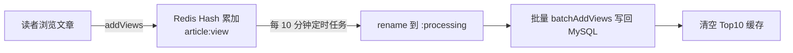

# 文迹 · 后端（article_trace_back）

基于 **Spring Boot 3 + MyBatis-Plus** 的文章平台后端服务，采用 `Controller → Service → Mapper` 三层架构，为前端提供 REST 接口。

## 技术栈

| 类别 | 技术 | 版本 |
|---|---|---|
| 框架 | Spring Boot | 3.5.9 |
| 语言 | Java | 21 |
| ORM | MyBatis-Plus | 3.5.15 |
| 数据库 | MySQL | 8.0 |
| 缓存 | Redis（Lettuce） | — |
| 对象存储 | RustFS（AWS S3 SDK） | 2.25.27 |
| 鉴权 | JWT（java-jwt） | 4.4.0 |
| 密码加密 | BCrypt（jbcrypt） | 0.4 |
| HTML 解析 | jsoup | 1.17.2 |
| 其他 | Lombok / Validation / Actuator | — |

## 目录结构

```
article_trace_back/
├── pom.xml                                  # Maven 依赖管理
├── res/
│   └── sensitive_words.txt                  # 外部敏感词库（一行一词，支持热更新）
└── src/main/
    ├── java/com/articleTraceBack/
    │   ├── ArticleTraceBackApplication.java # 启动类（@EnableScheduling）
    │   ├── Controller/                      # 控制层（REST 接口）
    │   │   ├── ArticleController.java       #   文章：增删改查/审核/封面
    │   │   ├── CategoryController.java      #   分类：增删改查
    │   │   ├── ReaderController.java        #   读者：文章浏览/评论/作者信息
    │   │   └── UserController.java          #   用户：注册/登录/信息/账号管理
    │   ├── Service/                         # 业务层（接口 + 实现）
    │   │   ├── ArticleService.java / ArticleServiceImpl.java
    │   │   ├── CategoryService.java / CategoryServiceImpl.java
    │   │   ├── ReaderService.java / ReaderServiceImpl.java
    │   │   └── UserService.java / UserServiceImpl.java
    │   ├── mapper/                          # 数据访问层（MyBatis-Plus）
    │   │   ├── ArticleMapper.java           #   文章自定义 SQL（分页/统计/批量加浏览量）
    │   │   ├── CategoryMapper.java
    │   │   ├── CommentMapper.java
    │   │   └── UserMapper.java
    │   ├── pojo/                            # 实体与数据对象
    │   │   ├── Article.java                 #   文章实体
    │   │   ├── Category.java                #   分类实体
    │   │   ├── Comment.java                 #   评论实体
    │   │   ├── User.java                    #   用户实体
    │   │   ├── Result.java                  #   统一响应包装
    │   │   ├── PageBean.java                #   分页包装
    │   │   ├── WriterInfo.java              #   作者信息视图对象
    │   │   └── RegisterUserPojo.java / ForgetPassPojo.java / UpdatePassPojo.java
    │   ├── Utils/                           # 工具类
    │   │   ├── AhoCorasickUtil.java         #   Aho-Corasick 敏感词匹配
    │   │   ├── BcryptUtils.java             #   BCrypt 密码加密
    │   │   ├── JwtUtil.java                 #   JWT 生成与解析
    │   │   ├── TokenCheck.java              #   登录拦截器（鉴权 + 权限分级）
    │   │   ├── ThreadLocalUtil.java         #   ThreadLocal 上下文传递
    │   │   ├── RichTextCleaner.java         #   富文本清洗（jsoup）
    │   │   ├── TextExtractor.java           #   纯文本提取/摘要
    │   │   ├── RustFsUtil.java              #   RustFS/S3 对象存储封装
    │   │   ├── GenResetPass.java            #   重置码生成
    │   │   ├── IPUtil.java                  #   客户端 IP 获取
    │   │   └── GlobalExceptionHandler.java  #   全局异常捕获
    │   ├── config/                          # 配置类
    │   │   ├── WebConfig.java               #   拦截器注册
    │   │   ├── RedisConfig.java             #   Redis 双库模板配置
    │   │   └── SensitiveWordConfig.java     #   敏感词 Bean 装配
    │   ├── runner/
    │   │   └── AdminInitializer.java        #   启动时自动创建站长账号
    │   └── scheduledTask/                   # 定时任务
    │       ├── SyncRedisToDbTask.java       #   Redis 浏览量 → MySQL 同步
    │       └── SyncSensitiveWordLoader.java #   敏感词库热更新
    └── resources/
        ├── application.yml                  # 实际配置（含密钥，已 gitignore）
        ├── application_templete.yml         # 配置模板（${} 占位符）
        └── sensitive_words.txt              # 内置敏感词库
```

## 项目细节实现

### 1. 鉴权与权限控制

**流程**：登录成功 → 后端签发 JWT（载荷含 `id` / `username` / `type`）→ 存入 Redis → 返回 Token。后续请求携带 `Authorization` 头，由 `TokenCheck` 拦截器校验。

- **JWT 有效期**：勾选「记住我」为 72 小时（`longTime`），否则 24 小时（`shortTime`）。
- **双重校验**：拦截器解析 JWT 后，再与 Redis 中存储的 Token 比对，实现单点登录（一处登录、他处失效）。
- **ThreadLocal**：校验通过后，用户信息写入 `ThreadLocalUtil`，业务层无侵入读取；请求结束在 `afterCompletion` 中清理。
- **权限分级**（`spring.tokenCheck.notAllowUrl`）：

| 角色 | 禁止访问 |
|---|---|
| 作者（writer） | 账号管理、文章审核、删除他人等 |
| 读者（reader） | 分类管理、文章管理全部接口 |

拦截器对 `/reader/**` 默认放行（浏览文章无需登录），仅 `addComment` / `deleteComment` 要求登录。

### 2. 用户模块（UserController / UserServiceImpl）

- **注册**：作者需注册码（`Password.registerPass`），读者无需；密码 BCrypt 加密，同时生成重置码（`reset_pass`）。
- **登录**：校验密码 → 签发 Token → 写 Redis → 记录最后登录时间。
- **忘记密码**：凭用户名 + 重置码设置新密码。
- **修改信息/头像**：头像经 `MultipartFile` 上传至 RustFS 图片桶。
- **账号管理（站长）**：分页查看所有账号、变更用户身份（需站长密码）、删除账号（保护默认账号与自身）。

### 3. 文章模块（ArticleController / ArticleServiceImpl）

- **新增/更新**：标题 + 内容先做敏感词校验 → 内容以 JSON 形式上传 RustFS 内容桶（文件名 `时间戳-用户ID.json`）→ 数据库仅存文件名，读取时实时从 RustFS 拉取。
- **封面**：独立上传至图片桶，预签名 URL 缓存于 Redis（3 天有效期）。
- **审核**：站长通过 `assess` 接口将文章状态置为已发布（1）或驳回（3）。
- **删除**：级联删除 RustFS 图片/内容文件 + 清理 Redis 浏览量 + 删除数据库记录。

### 4. 分类模块（CategoryController / CategoryServiceImpl）

作者创建分类，支持增删改查；删除分类时校验「仅创建人可删」。文章关联分类外键，分类删除后文章 `category_id` 置空。

### 5. 评论模块（ReaderController / ReaderServiceImpl）

- 登录读者可评论，评论内容经敏感词过滤，长度 ≤ 200。
- **分级删除**：站长删任意评论；作者删自己文章下的评论；读者删自己的评论。

### 6. 敏感词过滤（AhoCorasickUtil + SyncSensitiveWordLoader）

- 采用 **Aho-Corasick** 自动机，一次遍历文本即可匹配所有敏感词，效率远高于逐个 `contains`。
- 词库支持**热更新**：定时任务（默认 30 分钟）检测 `res/sensitive_words.txt` 的修改时间，变化则重建自动机，无需重启。
- 文章标题 + 内容（富文本清洗后）与评论均做敏感词校验。

### 7. 富文本清洗（RichTextCleaner / TextExtractor）

基于 jsoup 清洗富文本：移除 `<script>/<style>` 与图片标签、base64 图片，块级标签转换行，压缩空白，输出纯文本用于敏感词校验与文章摘要展示。

### 8. 对象存储（RustFsUtil）

基于 AWS S3 SDK 封装，`图片桶（pic）` 与 `内容桶（content）` 分桶存储。图片访问通过 `S3Presigner` 生成 3 天有效期的预签名 URL，并缓存至 Redis 减少签名开销。

### 9. 浏览量统计（SyncRedisToDbTask）



- 同一用户（登录用户或 IP+UA 标识）24 小时内对同一文章只计一次（去重键存 Redis）。
- 热门文章 Top10 结果缓存 5 分钟。

### 10. 全局异常处理（GlobalExceptionHandler）

自定义异常捕获器，统一封装异常为 `Result` 格式返回，前端 `request.js` 响应拦截器据此提示，401 时自动清除 Token 并跳转首页。

### 11. 管理员自动初始化（AdminInitializer）

启动时若配置了 `enableAutoConfig=true` 且默认站长账号不存在，则自动创建 `type=0` 的站长账号（密码 BCrypt 加密）。

## 数据库设计

数据库 `article_trace`，共 4 张表（见根目录 `article_trace.sql`）。

### `user` 用户表

| 字段 | 类型 | 说明 |
|---|---|---|
| id | int | 主键，自增 |
| username | varchar(20) | 用户名（唯一） |
| password | varchar(60) | 密码（BCrypt） |
| nickname | varchar(15) | 昵称 |
| email | varchar(128) | 邮箱 |
| user_pic | varchar(128) | 头像文件名 |
| create_time / update_time / last_login | datetime | 时间戳 |
| reset_pass | varchar(60) | 重置码 |
| type | int | 0 站长 / 1 作者 / 2 读者 |

### `category` 分类表

| 字段 | 类型 | 说明 |
|---|---|---|
| id | int | 主键 |
| category_name | varchar(20) | 分类名 |
| category_alias | varchar(30) | 分类别名 |
| create_user / last_update_user | int | 创建人 / 最后更新人 |
| create_time / update_time | datetime | 时间戳 |

### `article` 文章表

| 字段 | 类型 | 说明 |
|---|---|---|
| id | int | 主键 |
| title | varchar(30) | 标题 |
| content | varchar(50) | 内容文件名（实际内容存 RustFS） |
| cover_img | varchar(128) | 封面文件名 |
| state | int | 0 草稿 / 1 发布 / 2 待审 / 3 驳回 |
| category_id | int | 分类外键 |
| create_user | int | 创建人外键 |
| create_time / update_time | datetime | 时间戳 |
| views | bigint | 浏览量 |

### `comments` 评论表

| 字段 | 类型 | 说明 |
|---|---|---|
| id | int | 主键 |
| article_id | int | 文章外键（级联删除） |
| content | varchar(200) | 评论内容 |
| user_id | int | 用户外键（级联删除） |
| user_pic | varchar(128) | 用户头像 |
| create_time | datetime | 时间戳 |

## 核心接口概览

统一响应格式 `Result`：`{ "code": 200, "message": "...", "data": ... }`。

### 用户 `/user`

| 方法 | 路径 | 说明 |
|---|---|---|
| POST | `/user/register` | 注册 |
| POST | `/user/login` | 登录 |
| GET | `/user/userInfo` | 获取个人信息 |
| PATCH | `/user/update` | 更新信息 |
| PATCH | `/user/updateUserLogo` | 上传头像 |
| PATCH | `/user/updatePass` | 修改密码 |
| POST | `/user/forgetPass` | 忘记密码 |
| GET | `/user/logout` | 登出 |
| GET | `/user/accountManage` | 账号分页（站长） |
| PATCH | `/user/changeType` | 变更身份（站长） |
| DELETE | `/user/delete` | 删除账号（站长） |

### 文章 `/article`

| 方法 | 路径 | 说明 |
|---|---|---|
| GET | `/article/list` | 我的文章分页 |
| POST | `/article/add` | 新增文章 |
| GET | `/article/detail/{id}` | 文章详情 |
| PATCH | `/article/update/{id}` | 更新文章 |
| DELETE | `/article/delete` | 删除文章 |
| PATCH | `/article/uploadCover` | 上传封面 |
| DELETE | `/article/removeCover` | 删除封面 |
| GET | `/article/count` | 文章统计 |
| GET | `/article/manageArticles` | 全站文章分页（站长） |
| PATCH | `/article/assess` | 审核文章（站长） |

### 分类 `/category`

| 方法 | 路径 | 说明 |
|---|---|---|
| POST | `/category/add` | 新增分类 |
| GET | `/category` | 分类列表 |
| GET | `/category/detail/{id}` | 分类详情 |
| PATCH | `/category/update/{id}` | 更新分类 |
| DELETE | `/category/delete/{id}` | 删除分类 |

### 读者 `/reader`

| 方法 | 路径 | 说明 |
|---|---|---|
| GET | `/reader/getArticles` | 公开文章分页（分类/搜索/作者） |
| GET | `/reader/article/{id}` | 文章详情 |
| GET | `/reader/writerInfo` | 作者信息 |
| GET | `/reader/masterInfo` | 站长信息 |
| POST | `/reader/addComment` | 发表评论 |
| DELETE | `/reader/deleteComment` | 删除评论 |
| GET | `/reader/comments` | 评论分页 |
| PATCH | `/reader/article/addViews/{id}` | 增加浏览量 |
| GET | `/reader/article/hotArticles` | 热门文章 Top10 |

## 部署

### 基础环境

| 组件 | 版本/说明 |
|---|---|
| Java | 21 |
| MySQL | 8.0 |
| Redis | 6+ |
| RustFS | S3 兼容对象存储 |

### 启动步骤

1. 初始化数据库：`source article_trace.sql`。
2. 配置 RustFS：启动后访问 `IP:9001` 创建 `pic` 与 `content` 两个私密桶。
3. 配置：复制 `application_templete.yml` 为 `application.yml`，填写 `${}` 占位符（数据库、Redis、JWT 密钥、RustFS 凭据、默认管理员等）。`application.yml` 已被 `.gitignore` 忽略，不会提交到仓库。
4. 启动：

```bash
mvn spring-boot:run
# 或打包后运行
mvn clean package && java -jar target/article_trace-*.jar
```

### 外部敏感词库

在服务启动的工作目录下创建 `res/sensitive_words.txt`，一行一词。默认每 30 分钟检查一次文件变化并热更新，无需重启服务。
