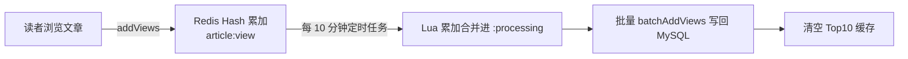
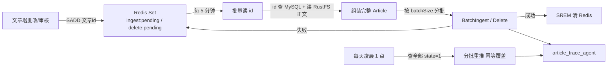

# 文迹 · 后端（article_trace_back）

基于 **Spring Boot 3 + MyBatis-Plus** 的文章平台后端服务，采用 `Controller → Service → Mapper` 三层架构，为前端提供 REST 接口，并通过 gRPC 与 `article_trace_agent` 检索问答服务通信。

## 技术栈

| 类别 | 技术 | 版本 |
|---|---|---|
| 框架 | Spring Boot | 3.5.9 |
| 语言 | Java | 21 |
| ORM | MyBatis-Plus | 3.5.15 |
| 数据库 | MySQL | 8.0 |
| 缓存 | Redis（Lettuce） | — |
| 对象存储 | RustFS（AWS S3 SDK） | 2.25.27 |
| 鉴权 | JWT（java-jwt） | 4.4.0 |
| 密码加密 | BCrypt（jbcrypt） | 0.4 |
| HTML 解析 | jsoup | 1.17.2 |
| RPC | gRPC / Protobuf | 1.68.1 / 3.25.5 |
| 邮件 | Spring Mail（SMTP） | — |
| 其他 | Lombok / Validation / Actuator | — |

## 目录结构

```
article_trace_back/
├── pom.xml                                  # Maven 依赖管理（含 gRPC + protobuf 插件）
├── res/
│   └── sensitive_words.txt                  # 外部敏感词库（一行一词，支持热更新）
└── src/main/
    ├── proto/
    │   └── article_agent.proto              # gRPC 契约（与 agent 侧共享，mvn compile 自动生成 stub）
    ├── java/com/articleTraceBack/
    │   ├── ArticleTraceBackApplication.java # 启动类（@EnableScheduling）
    │   ├── Controller/                      # 控制层（REST 接口）
    │   │   ├── ArticleController.java       #   文章：增删改查/审核/封面
    │   │   ├── CategoryController.java      #   分类：增删改查
    │   │   ├── ReaderController.java        #   读者：文章浏览/评论/作者信息
    │   │   ├── UserController.java          #   用户：注册/登录/信息/账号管理
    │   │   ├── AgentController.java         #   检索问答/会话管理/探活
    │   │   ├── NotificationController.java  #   站内信（列表/未读数/已读/删除）
    │   │   ├── AuthorApplyController.java   #   作者申请（提交/列表/审批）
    │   │   ├── AvatarApplyController.java   #   头像审核（待审状态/审核列表/审批）
    │   │   └── ReportController.java        #   举报（提交/站长列表/处置）
    │   ├── Service/                         # 业务层（接口 + 实现）
    │   │   ├── ArticleService.java / ArticleServiceImpl.java
    │   │   ├── CategoryService.java / CategoryServiceImpl.java
    │   │   ├── ReaderService.java / ReaderServiceImpl.java
    │   │   ├── UserService.java / UserServiceImpl.java
    │   │   ├── AgentSessionService.java / AgentSessionServiceImpl.java
    │   │   ├── NotificationService.java / NotificationServiceImpl.java
    │   │   ├── MailService.java / MailServiceImpl.java
    │   │   ├── EmailCodeService.java / EmailCodeServiceImpl.java      # 邮箱验证码（注册/找回密码）
    │   │   ├── CaptchaService.java / CaptchaServiceImpl.java          # 图形验证码（人机校验）
    │   │   ├── LoginAttemptService.java / LoginAttemptServiceImpl.java # 登录失败计数与黑名单
    │   │   ├── AuthorApplyService.java / AuthorApplyServiceImpl.java
    │   │   ├── AvatarApplyService.java / AvatarApplyServiceImpl.java   # 头像上传审核
    │   │   └── ReportService.java / ReportServiceImpl.java             # 举报（提交/查询/处置）
    │   ├── rpc/                             # gRPC 客户端（调用 agent）
    │   │   ├── ArticleAgentClient.java      #   7 个 RPC 方法封装（另含 isEnabled/init/shutdown；容错 + 超时）
    │   │   └── ArticleProtoMapper.java      #   Java 实体 ↔ proto 消息转换
    │   ├── mapper/                          # 数据访问层（MyBatis-Plus）
    │   │   ├── ArticleMapper.java           #   文章自定义 SQL（分页/统计/批量加浏览量）
    │   │   ├── CategoryMapper.java
    │   │   ├── CommentMapper.java
    │   │   ├── NotificationMapper.java      #   站内信（含分页/统计）
    │   │   ├── NotificationMailMapper.java  #   邮件投递记录
    │   │   ├── AuthorApplyMapper.java       #   作者申请（含联查/统计）
    │   │   ├── AvatarApplyMapper.java       #   头像审核（含联查/统计）
    │   │   ├── ReportMapper.java            #   举报（含联查/统计）
    │   │   └── UserMapper.java
    │   ├── pojo/                            # 实体与数据对象
    │   │   ├── Article.java                 #   文章实体
    │   │   ├── Category.java                #   分类实体
    │   │   ├── Comment.java                 #   评论实体
    │   │   ├── User.java                    #   用户实体
    │   │   ├── Result.java                  #   统一响应包装
    │   │   ├── PageBean.java                #   分页包装
    │   │   ├── WriterInfo.java              #   作者信息视图对象
    │   │   ├── AgentAskRequest.java         #   问答请求体
    │   │   ├── AgentMatchedArticle.java     #   问答命中的文章
    │   │   ├── AgentSession.java            #   会话摘要（列表项）
    │   │   ├── AgentChatMessage.java        #   会话消息
    │   │   ├── Notification.java            #   站内信
    │   │   ├── NotificationMail.java        #   邮件投递记录
    │   │   ├── AuthorApply.java             #   作者申请
    │   │   ├── AvatarApply.java             #   头像审核记录
    │   │   ├── Report.java                  #   举报记录
    │   │   └── RegisterUserPojo.java / ForgetPassPojo.java / UpdatePassPojo.java
    │   ├── Utils/                           # 工具类
    │   │   ├── AhoCorasickUtil.java         #   Aho-Corasick 敏感词匹配
    │   │   ├── BcryptUtils.java             #   BCrypt 密码加密
    │   │   ├── JwtUtil.java                 #   JWT 生成与解析
    │   │   ├── TokenCheck.java              #   登录拦截器（鉴权 + 权限分级）
    │   │   ├── ThreadLocalUtil.java         #   ThreadLocal 上下文传递
    │   │   ├── RichTextCleaner.java         #   富文本清洗（jsoup）
    │   │   ├── TextExtractor.java           #   纯文本提取/摘要
    │   │   ├── RustFsUtil.java              #   RustFS/S3 对象存储封装
    │   │   ├── ThumbnailUtil.java           #   图片缩略图生成（Thumbnailator）
    │   │   ├── EmailUtil.java               #   邮件发送（SMTP，含 multipart 双载体）
    │   │   ├── EmailTemplateUtil.java       #   邮件模板加载与占位符渲染
    │   │   ├── FileCheckUtil.java           #   上传图片校验（MIME 与扩展名都须通过）
    │   │   ├── PageUtil.java                #   分页参数归一化（页码下限 / 每页条数上限）
    │   │   ├── IPUtil.java                  #   客户端 IP 获取
    │   │   └── GlobalExceptionHandler.java  #   全局异常捕获
    │   ├── config/                          # 配置类
    │   │   ├── WebConfig.java               #   拦截器注册
    │   │   ├── RedisConfig.java             #   Redis 双库模板配置
    │   │   ├── SensitiveWordHolder.java     #   敏感词匹配器持有者（业务与定时任务共用可替换引用）
    │   │   ├── NotificationProperties.java  #   通知/邮件配置绑定
    │   │   └── AsyncConfig.java             #   邮件异步线程池
    │   ├── constant/                        # 常量
    │   │   └── RedisKeys.java               #   跨类共用的 Redis key（article:hot:top10 等）
    │   ├── runner/
    │   │   ├── AdminInitializer.java        #   启动时自动创建站长账号
    │   │   └── ThumbnailBackfillRunner.java #   存量缩略图补齐（可选）
    │   └── scheduledTask/                   # 定时任务
    │       ├── SyncRedisToDbTask.java       #   Redis 浏览量 → MySQL 同步
    │       ├── SyncSensitiveWordLoader.java #   敏感词库热更新
    │       ├── AgentSyncTask.java           #   知识库增量同步 + 全量对账（gRPC）
    │       ├── MailRetryTask.java           #   失败邮件重试
    │       ├── AuthorApplyRemindTask.java   #   待审作者申请提醒（每 12 小时邮件站长）
    │       ├── AvatarApplyRemindTask.java   #   待审头像提醒（每 12 小时邮件站长）
    │       └── NotificationCleanupTask.java #   站内信清理（30 天）
    └── resources/
        ├── application.yml                  # 实际配置（含密钥，已 gitignore）
        ├── application_templete.yml         # 配置模板（${} 占位符）
        ├── sensitive_words.txt              # 内置敏感词库
        └── templates/email/                 # 邮件模板（email-code、avatar-rejected，各含 .html + .txt 两份）
```

## 项目细节实现

### 1. 鉴权与权限控制

**流程**：登录成功 → 后端签发 JWT（载荷含 `id` / `username` / `type`）→ 存入 Redis → 以 **HttpOnly Cookie**（`article_trace_token`）下发。后续请求由浏览器自动携带该 Cookie，`TokenCheck` 拦截器从 Cookie 读取并校验。

> **为什么不用 `Authorization` 头**：`localStorage` 对同源 JS 完全可读，一旦出现 XSS（哪怕只是某个第三方脚本被投毒）Token 立刻失窃；HttpOnly Cookie 拿不到 `document.cookie`，脚本偷不走。因此拦截器**只认 Cookie**，不兼容头传方式。
>
> **代价是 CSRF**：Cookie 由浏览器自动携带，攻击者站点发起的请求也会带上。用 `SameSite=Lax` 挡住——它规定跨站请求不带 Cookie（顶层导航的 GET 除外），而本项目写操作全是 POST/PATCH/DELETE，所以这一条就够，无需再维护 CSRF token。唯一的 GET 写操作是登出，已随之改为 POST。

- **JWT 有效期**：勾选「记住我」为 72 小时（`longTime`），否则 24 小时（`shortTime`）。Cookie 的 `Max-Age` 与之一致，避免出现「Cookie 还在、Redis 已不认」。
- **Cookie 安全开关**：`JWT.cookieSecure`（容器侧由 `JWT_COOKIE_SECURE` 透传）。本地 http 调试必须为 `false`，置 `true` 浏览器不会保存 Cookie、登录会一直失败；站点上 HTTPS 后改 `true`。
- **双重校验**：拦截器解析 JWT 后，再与 Redis 中存储的 Token 比对，实现单点登录（一处登录、他处失效）。
- **ThreadLocal**：校验通过后，用户信息写入 `ThreadLocalUtil`，业务层无侵入读取；请求结束在 `afterCompletion` 中清理。
- **权限分级**（`spring.tokenCheck.notAllowUrl`）：

| 角色 | 禁止访问 |
|---|---|
| 作者（writer） | 账号管理、文章审核、删除他人等 |
| 读者（reader） | 分类管理、文章管理全部接口 |

拦截器对 `/reader/**` 默认放行（浏览文章无需登录），仅 `addComment` / `deleteComment` 要求登录。

> **站长专属接口按 URL 前缀统一拦截**：形如 `/xxx/manage/**` 的路径加进 `notAllowUrl` 即可，
> 不必逐个方法写权限判断。新增站长接口时优先按这个约定命名。
> 注意两组规则并不对称——作者查的是「writer ∪ reader」并集，读者只查 `reader`，
> 所以**加进 `reader` 两组都会命中**。
>
> 匹配方式是 `getRequestURI().contains(url)` **子串包含**（不是 Ant 通配），
> 路径不要写得太短，否则会误伤其他接口。

### 2. 用户模块（UserController / UserServiceImpl）

- **注册**：读者自助注册，邮箱验证码校验（见「验证码」相关小节）；密码 BCrypt 加密。注册一律为读者，成为作者走「申请-审批」。注册时无需填昵称，后端会自动生成一个默认昵称（`文迹探索者` + 6 位随机串）。
- **登录**：校验密码 → 签发 Token → 写 Redis → 下发 HttpOnly Cookie → 记录最后登录时间。
- **登出**：`POST /user/logout`，删掉 Redis 中的 Token **并**下发过期 Cookie 让浏览器丢弃它——只删 Redis 的话 Cookie 还在，浏览器下次仍会带着它发请求。
- **忘记密码**：凭注册邮箱 + 邮箱验证码设置新密码；改密后旧登录态立即失效。
- **修改信息/头像**：头像经 `MultipartFile` 上传至 RustFS 的 **avatar 桶**并生成一条待审记录，**此时 `user_pic` 一动不动**（用户仍看到旧头像）。站长审批通过后，对象被复制到 pic 桶并写入 `user_pic`，旧头像随即删除；拒绝则丢掉待审对象。**站长改自己的头像免审核**——他是唯一能审的人，审自己没意义；直通路径（`AvatarApplyService.submitDirect`）与审核通过**共用 `promote()`**，搬运/换指向/清旧对象与待审对象一步都不省。
- **账号管理（站长）**：分页查看所有账号、变更用户身份（需站长密码）、删除账号（保护默认账号与自身）；删除时会**级联清理该用户的作者申请记录与头像审核记录**（后者由 `avatar_apply` 的外键 `ON DELETE CASCADE` 自动完成），避免留下没有对应用户的悬挂数据。

### 3. 文章模块（ArticleController / ArticleServiceImpl）

- **新增/更新**：标题 + 内容先做敏感词校验 → 内容以 JSON 形式上传 RustFS 内容桶（文件名 `时间戳-用户ID.json`）→ 数据库仅存文件名，读取时实时从 RustFS 拉取。
  - **新增不接受客户端传入的 `id`**（强制 `setId(null)`），避免借 `insertOrUpdate` 覆盖他人文章。
  - **标题在同一作者内唯一**（`uk_user_title`）：应用层按 `(create_user, title)` 查重，并发冲突由唯一索引兜底并转成友好提示；不同作者可以同名。
  - **标题 1-30 字符，允许中间空格、首尾不能是空格**（`^\S(.*\S)?$` + `@Size`）；`@NotBlank` 顺带堵住「纯空格也能过」。分类名与昵称同此规则，且长度都与数据库列宽对齐（分类名 ≤ 20、分类别名 ≤ 30、昵称 2-20）。
  - **目标状态由服务端决定**：请求体里的 `state` 只当作「草稿 / 提交」的意图（`resolveTargetState`），作者只能落到草稿(0) 或送审(2)，只有站长才能直接发布(1)。取值不在 `{0,1,2,3}` 内报「非合理值！」。
  - **命中违禁词时目标状态被强制改成待审(2)**，站长也一样；详见第 6 节。
- **封面**：**随文章一次性 multipart 提交**（`POST /article/add`、`PATCH /article/update/{id}` 接收 `article` JSON + 可选 `cover` 文件），不再有独立的封面上传端点。
  - 带文件 → 上传新图，**对象名由服务端生成**；写库成功后旧封面才被删除。
  - 不带文件且 `coverImg` 为空串 → 删除封面（写库成功后删对象）。
  - 不带文件且 `coverImg` 为 null 或其它值 → **回退为库中原值**，客户端无法指定任意 key。
  - 写库失败时回收本次上传的新文件，DB 与对象存储始终保持一致。
  - 这样用户中途放弃发布**不会在服务端留下无引用对象**（此前"选图即上传"会产生这类垃圾）。
- **审核**：站长通过 `assess` 接口审核，只接受目标 `1`（通过）/ `3`（驳回）；先按状态机校验当前状态能否流转（`2→1`、`2→3`、`1→3`），再带「当前状态」条件更新 —— 两个站长并发审批时只有先到者成功。
  > **为什么 WHERE 里必须带状态**：MySQL 驱动默认返回的是**匹配行数**而非实际修改行数。若判断「是否抢到」时 WHERE 只带主键，并发下两条更新都会匹配到 1 行，双双被误判成功。
- **删除**：级联删除 RustFS 图片/内容文件 + 清理 Redis 浏览量 + 删除数据库记录。

### 4. 分类模块（CategoryController / CategoryServiceImpl）

作者创建分类，支持增删改查；**更新与删除均校验「仅创建人可操作」**。分类名全局唯一（`uk_category_name`）。文章关联分类外键，分类删除后文章 `category_id` 置空。

### 5. 评论模块（ReaderController / ReaderServiceImpl）

- 登录读者可评论，评论内容经敏感词过滤，长度 ≤ 200。
- **分级删除**：站长删任意评论；作者删自己文章下的评论；读者删自己的评论。

### 6. 敏感词过滤（AhoCorasickUtil + SyncSensitiveWordLoader）

- 采用 **Aho-Corasick** 自动机，一次遍历文本即可匹配所有敏感词，效率远高于逐个 `contains`。
- 词库支持**热更新**：外部词库 `res/sensitive_words.txt`（compose 已挂到容器 `/app/res`），
  **外部优先、缺失或读取失败时降级到 jar 内置词表**（`src/main/resources/sensitive_words.txt`）。
  默认 30 分钟检测一次修改时间，变化则重建自动机；**改词库不用重启、也不用重建镜像**。详见下方「敏感词库（外部优先）」。
- 文章标题 + 内容（富文本清洗后）与评论均做敏感词校验。
- **文章命中后不再驳回，而是「落待审 + 打标 + 优先审核」**：判定从「方法开头直接返回错误」挪到了目标状态确定之后，命中时把目标强制改成 `2`，**站长自己发布也不例外**。`sensitive_hit` 记「是否命中」（排序与筛选用），`sensitive_words` 记「命中了哪些词」——后者是审核人判断「误伤还是真违规」的唯一依据。**标记每次写入都重算**，作者把词改掉后重投会自动清零。
- **审核列表只在筛「待审核」时按 `sensitive_hit desc` 优先排序**（`ArticleMapper` 里用 `<script>` + `<if test='state != null and state == 2'>` 插排序键，其余视图保持时间序）。必须服务端排——列表是分页的，前端排序只作用于当前页。
- **这两个字段只回给站长**：`Article.hideSensitiveDetail()` 在作者自己的列表、公开列表、单篇详情三处清洗。返回给作者等于把词库逐条告诉他，他就能绕着写；前端也只对站长弹「已转入待审」的提示。

### 7. 富文本清洗（RichTextCleaner / TextExtractor）

基于 jsoup 清洗富文本：移除 `<script>/<style>` 与图片标签、base64 图片，块级标签转换行，压缩空白，输出纯文本用于敏感词校验与文章摘要展示。

另提供 `cleanToSafeHtml()` 做**白名单清洗并保留 HTML**，用于落库与回显：基于 `Safelist.relaxed()`，额外放行 `figure/figcaption/hr` 与 `:all` 的 `class`、`img` 的 `alt/width/height`、`a` 的 `target/rel`，协议限 `http/https`（外链另加 `mailto`）。

**存前与读时两头都清洗**：`articleAddOrUpdate` 落库前洗一次；三处读取走 `readCleanContent()`，`AgentSyncTask` 同步给 agent 前也洗。这样历史脏数据在**读时**同样被拦住，不必手工洗存量。

> 前端转义不是替代方案：富文本要么全转义（排版全毁）、要么不转义（XSS），没有中间态。

### 8. 对象存储（RustFsUtil）

基于 AWS S3 SDK 封装，按业务分三个桶：`图片桶（pic）`、`内容桶（content）`、`头像桶（avatar）`。图片访问通过 `S3Presigner` 生成 3 天有效期的预签名 URL，并缓存至 Redis 减少签名开销。

桶名不是写死的：由 `RUSTFS_PIC_BUCKET` / `RUSTFS_CONTENT_BUCKET` / `RUSTFS_AVATAR_BUCKET` 统一驱动（`.env` → compose → 容器配置 `application-container.yml` 里的 `${RUSTFS_*_BUCKET:...}` 占位符）。**建桶（`rustfs-init`）与后端读写用的是同一组值**，改就一起改，避免「桶建成新名字、后端仍连旧名字」。

> `S3.endpoint` 会写进预签名 URL 的 host（同一个值同时喂给 SDK 客户端和签名器），所以它必须是**浏览器能访问到的地址**；上公网部署时把它改成对象存储的对外域名。

对象归属由**类型字符串**决定，而不是散落的桶名常量：`json` → content、`image` → pic、`avatar` → avatar，`upload` / `delete` / `exists` / `getPciUrl` / `getThumbUrl` / `generateThumbFor` 都按它解析目标桶。预签名的 Redis 缓存键是 `桶名:对象名`——两个桶可能出现同名对象，只用对象名会串味。

**缩略图机制**：上传图片时自动生成缩略图（Thumbnailator 等比缩放至 400px 宽，JPEG 质量 0.8），以 `thumb_` 前缀与原图同桶存储；删除图片时连带删除缩略图。封面、头像、评论头像、作者卡头像均返回缩略图 URL（`*ThumbSrc`），列表/小尺寸展示用缩略图、详情/预览用原图。存量图片可通过 `thumbnail.backfill.enabled=true` 启动时一次性补齐（无封面/头像的记录自动跳过）。

### 9. 浏览量统计（SyncRedisToDbTask）



- 同一用户（登录用户或 IP+UA 标识）24 小时内对同一文章只计一次（去重键存 Redis）。
- 热门文章 Top10 结果缓存 5 分钟。

### 10. 全局异常处理（GlobalExceptionHandler）

自定义异常捕获器，统一封装异常为 `Result` 格式返回，前端 `request.js` 响应拦截器据此提示，401 时提示「登录已失效」并跳转首页（凭证在 Cookie 里，由后端清除）。

> ⚠️ **它会把 `405 Method Not Allowed` 也包成 `HTTP 200 + code:1`**。所以改后端 HTTP 方法时必须同步改前端调用方，且前端不能只看状态码判断成败——否则会像登出那样**静默失败**（Cookie 没清，用户却以为已退出）。

| 异常 | 返回 |
|---|---|
| `MethodArgumentNotValidException` / `HandlerMethodValidationException` | 按字段汇总校验错误 |
| `MissingServletRequestParameterException` | 「参数缺失！」 |
| `HttpMediaTypeNotSupportedException` | 不支持的媒体类型 + 支持的列表 |
| `HttpMessageNotReadableException` | **保留原始解析失败原因**（见下） |
| `MethodArgumentTypeMismatchException` | 类型不匹配提示 |
| `DuplicateKeyException` | 唯一约束冲突的统一提示 |
| `DataIntegrityViolationException` | 外键/长度/非空等约束的统一提示 |
| `Exception` | 兜底，统一结构，不把堆栈甩给调用方 |

**两处刻意的设计**：

1. **`HttpMessageNotReadableException` 保留真因**。Spring 的原始 message 形如
   ``JSON parse error: Cannot deserialize value of type `int` from String "abc"``，
   真正有用的信息在冒号**之后**。此前只截取冒号前那段，于是所有格式错误都回同一句
   「JSON parse error」——既没告诉调用方哪里错了，又在 message 不含冒号时因
   `substring(0, -1)` 直接越界，在异常处理器里再抛一次。
2. **`DuplicateKeyException` 不谎称是某个字段冲突**。异常里只有约束名，指不出调用方该改哪个字段，
   所以给统一提示；需要更精确话术的写入点（文章标题、分类名、邮箱等）自行 `catch` 后转换。

### 11. 管理员自动初始化（AdminInitializer）

启动时若配置了 `enableAutoConfig=true` 且默认站长账号不存在，则自动创建 `type=0` 的站长账号（密码 BCrypt 加密）。

## 与 article_trace_agent 的对接（gRPC）

后端通过 gRPC 与独立的 Python 检索问答微服务 `article_trace_agent` 通信，契约见 [src/main/proto/article_agent.proto](src/main/proto/article_agent.proto)。

### 可插拔开关与降级

agent 是**可选**依赖，由 `rpc.agent.enabled`（默认 `true`）统一控制。关闭时 Java 侧全部相关行为安全降级，主业务（文章增删改查、登录、注销、评论等）不受任何影响：

| 组件 | 关闭时行为 |
|---|---|
| `ArticleAgentClient` | 不建 gRPC channel；所有 RPC 直接返回失败态，不尝试连接 |
| `AgentController` | 接口保留但返回明确提示：`/ask` → SSE `error("AI 助手未启用")`；会话接口 → `Result.error("AI 助手未启用")`；`/health` → `{enabled:false, ok:false}` |
| `AgentSyncTask` | 两个定时任务直接返回，不读取/推送 Redis 待处理集合 |
| `ArticleServiceImpl` | 文章增删改审核时**不再写入** Redis 待同步集合（避免无消费者地堆积） |
| `AgentSessionService` | 不写会话索引；`clearAll` 仍清掉本地索引残留（不调 RPC） |

> 关闭期间的文章变更不会进入同步队列，重新启用后由「全量对账」（每天凌晨 1 点）兜底补齐。

### 契约方法

| 方法 | 方向 | 作用 |
|---|---|---|
| `IngestArticle` | Java → agent | 单篇推送/覆盖（按 article.id 幂等）。**Java 侧未使用**，批量场景走 `BatchIngestArticles` |
| `BatchIngestArticles` | Java → agent | 批量推送/覆盖 |
| `DeleteArticles` | Java → agent | 删除若干篇（下线/删除时） |
| `SyncArticles` | Java → agent | 全量/增量流式同步（客户端流式）。**Java 侧未使用**，对账走 `BatchIngestArticles` + `DeleteArticles` |
| `Ask` | Java ⇄ agent | 检索 + LLM 流式生成答案（服务端流式） |
| `ListSessions` | Java → agent | 列出会话（可选按 session_ids 过滤） |
| `GetSessionMessages` | Java → agent | 获取会话历史消息 |
| `DeleteSession` | Java → agent | 删除会话 |
| `Health` | Java → agent | 健康探活 + 入库统计 |

### 知识库同步机制（写链路）

业务侧**不直接推送**，而是把待处理的文章 id 写入 Redis，由定时任务统一批量推送，
避免每篇一次实时推送导致频繁的 BM25 索引重建与知识库 IO。



- **实时标记**（`ArticleServiceImpl`）：`articleAddOrUpdate` / `updateState` / `deleteById` 成功后，只把文章 id `SADD` 到 Redis（`agent:ingest:pending` 或 `agent:delete:pending`），不查正文、不调 RPC。
- **增量同步**（`AgentSyncTask.syncPendingUpdates`，每 5 分钟）：读 Redis 待处理 id → 先删后增 → 用 id 查 MySQL 元数据 + 读 RustFS 正文 → 组装完整 proto Article → 按 `batchSize` 分批推送 → 全部成功后清 Redis，失败保留重试。
- **全量对账**（`AgentSyncTask.fullSync`，每天凌晨 1 点）：兜底机制，查询全部 `state=1` 文章重新推送（agent 侧按 article.id 幂等覆盖），防止 Redis 丢失或增量漏推。
- **幂等与冲突**：`markIngestPending` / `markDeletePending` 互相移除对方集合中的同 id，保证「后到操作覆盖先到操作」。
- **旁路容错**：所有 Redis 写入与 RPC 调用均 try-catch + 日志，agent 不可用不影响主业务。

> **BM25 重建说明**：agent 侧采用「脏标记 + 惰性重建」——每批 ingest 只置脏标记，BM25 索引在下次检索前才重建一次，因此 Java 侧分多批推送**不会**导致多次重建。

### 客户端封装

`ArticleAgentClient`（`@Component`）统一管理 gRPC Channel 与 stub，所有方法带 deadline 并捕获异常；`askStream` 返回服务端流式迭代器；`ArticleProtoMapper` 负责 Java `Article` 实体与 proto 消息的双向转换（含状态枚举、时间格式化）。

### 会话管理（多轮对话）

会话历史由 `article_trace_agent` 侧持久化（jsonl），Java 侧由 `AgentSessionService` 维护「用户 ↔ 会话」归属索引（Redis Set `agent:session:user:{userId}`，前缀可配）实现按用户隔离：

- **首次问答**：前端不传 `sessionId`，agent 生成 UUID 并通过 `AskStreamChunk.session_id` 回传，`AgentController` 将其记入当前用户的 Redis Set，并以 SSE `session` 事件转发给前端；前端保存后，后续问答带上该 `sessionId` 即维持多轮上下文。
- **会话列表 / 历史 / 删除**：分别对应 `ListSessions` / `GetSessionMessages` / `DeleteSession` RPC，均按当前登录用户隔离（列表只查该用户映射到的会话，历史/删除先校验归属）。
- **注销清理**：账号注销（`UserServiceImpl.deleteUser`）后调用 `AgentSessionService.clearAll`，先逐个删除 agent 侧会话，再清空索引，避免残留。
- **索引不设 TTL**：它指向 agent 侧持久保存的会话记录，过期会导致用户凭空看不到历史会话，因此清理只发生在显式删除（用户删会话 / 账号注销）。

### 站内通知与邮件投递

分两层：`EmailUtil`（纯发信基础）与 `NotificationService`（业务通知门面）。

**① 发信基础 `EmailUtil`**

- `sendText(to, subject, content)` / `sendHtml(to, subject, html)`
- `sendMultipart(to, subject, text, html)`：一封邮件同时携带两种载体（`multipart/alternative`），
  由客户端择一显示——支持 HTML 的渲染富文本，纯文本客户端回落到 `text`
- 发送失败只记日志并返回 `false`，不影响调用方主流程
- 链路测试：`mvn test -Dtest=EmailUtilTest -Dmail.to=your@mail.com`（未指定收件人自动跳过）

**邮件模板**：正文不再硬编码在 Service 里，放在 `resources/templates/email/` 下，
同名模板有 `.html`（富文本）与 `.txt`（纯文本兜底）两份，占位符写作双花括号。渲染由
`EmailTemplateUtil` 完成；未提供值的占位符原样保留，便于上线前发现漏配。

**HTML 转义由调用层负责**：`EmailTemplateUtil` 自身不做转义（它对内容来源一无所知）。
`NotificationServiceImpl` 在渲染前**只对 HTML 载体**转义，纯文本载体按原样输出——
两个载体若共用一份变量表，纯文本客户端就会看到 `&lt;b&gt;` 这类字面量。
模板里的 logo 地址来自 `email.logoUrl`，**必须是公网可访问的绝对 URL**。
推荐把 logo 放在前端 `public/` 下（仓库已内置 `article_trace_front/public/logo2.png`），
构建后由 Nginx 直接托管，配置 `MAIL_LOGO_URL=https://你的域名/logo2.png` 即可；
换图只需替换 `public/` 下那个文件并重新构建，后端无需改动。

**② 通知门面 `NotificationService`**

业务只调这一个入口，投递渠道由 `notification.scenes` 按场景解析（`inbox` / `mail` / `both` / `none`）：

| 方法 | 作用 |
|---|---|
| `notify(receiverId, scene, title, content)` | 给单个用户发通知（站内 + 可选邮件）|
| `notify(…, mailTemplate, templateVars)` | 同上，但邮件按模板渲染双载体；业务变量传**原始值**，转义由本服务做 |
| `notifyRole(roleType, scene, title, content)` | 发给某角色全部用户（逐人一条）|
| `listByReceiver(receiverId, type, pageNum, pageSize)` | 分页查询，`type` 可选 `system` / `apply` / `avatar`（null 查全部）|
| `unreadCount(receiverId)` | 未读数 |
| `markRead(receiverId, id)` / `markAllRead(receiverId)` | 标记已读 |
| `delete(receiverId, id)` | 删除单条（以「id + receiver_id」双条件限定，删不到别人的）|
| `cleanupExpired(keepDays)` | 清理超过 N 天的站内信（定时任务调用）|

**调用方不感知成败**：全流程 try-catch，失败只记日志，绝不影响主业务。

**③ 邮件投递链路**

```
notify(...) → mailService.send(to, subject, content)      # 先落库 notification_mail(pending)
                                                          # 四参重载可带 contentHtml（双载体）
            → MailServiceImpl.submit() → mailExecutor.execute(deliver)  # 显式提交线程池（非 @Async）
            → EmailUtil 发信 → 回写 status=sent / failed(失败次数+1)
MailRetryTask（每 10 分钟）→ 重投 status=failed 且失败次数 ≤ maxRetry 的记录
```

- **落库先行**：即使异步任务被丢弃，记录仍在库里，重试任务能补 → 不丢邮件
- **重试上限**：默认 2 次重发（首次 + 2 次重试 = 最多 3 次尝试），超限停止并留日志（避免打爆 SMTP 日限额）
- **邮箱为空则跳过邮件渠道**，只投站内并记日志
- 测试：`mvn test -Dtest=MailServiceTest -Dmail.to=your@mail.com`

**④ 站内信清理**

`NotificationCleanupTask` 每天凌晨 3 点删除 **30 天前**的站内信（**无论是否已读**），保留天数与 cron 由 `notification.cleanup.*` 配置；清理按 `create_time` 过滤，依赖 `notification` 表上的 `create_time` 索引。

> 投递**不走 `@Async`**：`send()` 与 `retryFailed()` 都在 `MailServiceImpl` 内部触发投递，而 `@Async` 依赖 Spring 代理，同类自调用不会异步（会退化成阻塞业务线程的同步发信）。所以这里直接向线程池 `execute` 提交。

### 配置

```yaml
spring:
  mail:
    host: ${MAIL_HOST:smtp.qq.com}    # SMTP 服务器
    port: ${MAIL_PORT:465}            # 465=SMTPS；587 用 STARTTLS
    username: ${MAIL_USERNAME}        # 发件邮箱
    password: ${MAIL_PASSWORD}        # SMTP 授权码（非邮箱登录密码）
rpc:
  agent:
    enabled: true                     # 总开关：false 时 agent 全部降级（不建连、不写同步/会话数据）
    host: ${AGENT_HOST:localhost}     # agent gRPC 服务地址
    port: ${AGENT_PORT:50051}         # agent gRPC 端口
    sessionKeyPrefix: "agent:session:user:"  # 用户↔会话索引 key 前缀
    sync:
      enabled: true                   # 是否启用知识库定时同步
      cron: "0 */5 * * * ?"           # 增量同步：每 5 分钟
      fullSyncCron: "0 0 1 * * ?"     # 全量对账：每天凌晨 1 点
      batchSize: 100                   # 每批最多推送文章数
      ingestKey: "agent:ingest:pending"  # 待入库/更新文章 id 集合
      deleteKey: "agent:delete:pending"  # 待删除文章 id 集合
email:
  from: ${MAIL_FROM:}                # 发件人，留空则用 spring.mail.username
  subjectPrefix: "[文迹]"            # 邮件主题前缀
  logoUrl: ${MAIL_LOGO_URL:}         # 邮件模板 logo 地址（须公网可达的绝对 URL）
author-apply:
  remindCron: "0 0 0/12 * * ?"       # 每 12 小时检查待审作者申请，有则邮件提醒站长
notification:
  scenes:                            # 场景 → 渠道: inbox(仅站内) / mail(仅邮件) / both / none
    author-apply-submitted: both
    author-apply-approved: inbox
    author-apply-rejected: inbox
    author-apply-remind: mail
    avatar-submitted: both
    avatar-approved: inbox
    avatar-rejected: both
    avatar-remind: mail
    report-submitted: both
    report-handled: inbox
    report-rejected: inbox
    report-notice: inbox
    email-code: mail
  defaultChannel: inbox              # 未配置场景的默认渠道
  mail:
    enabled: true                    # 邮件渠道总开关（false 时 mail/both 降级为仅站内）
    maxRetry: 2                      # 最多重发次数
    retryCron: "0 */10 * * * ?"      # 失败邮件重试扫描
  cleanup:
    cron: "0 0 3 * * ?"              # 站内信清理：每天凌晨 3 点
    keepDays: 30                     # 保留 30 天（无论是否已读）
```

### 12. 验证码与登录防护

**① 邮箱验证码 `EmailCodeService`**

- 场景常量隔离：`SCENE_REGISTER`（注册）/ `SCENE_RESET`（找回密码），Redis key 为 `email:code:{scene}:{email}`。
- **6 位数字、5 分钟有效**；同一邮箱 **60 秒发送冷却**（`setIfAbsent` 抢占，防止刷验证码）。
- **一次性消费**：只有比对成功才删除 key，**输错不消费**（5 分钟内可反复重填，对手填场景更友好）。
- **失败计数 + 作废 + 锁定**（堵撞库）：输错累计 **5 次**即**删除验证码**并锁定该邮箱 **5 分钟**。三点缺一不可——
  - 必须**删码**：留着的话第 6 次撞对依然会通过，计数等于白加；
  - 必须**独立锁键**：借验证码剩余的 TTL 当锁，锁的时长会随「第几次才用尽」漂移；
  - **`send` 也要认锁**：只锁 verify 不锁 send，重新发一枚码就把计数与作废全绕过去了。
- **来源限流**：同一 IP+UA 每分钟最多 **30 次**校验（`email:code:client:{key}`），防止脚本换着邮箱扫。
- 上述「来源限流 → 锁定判定 → 比对 → 计数 → 作废/上锁」**全在一次 Redis Lua 内完成**，靠 Redis 单线程执行保证并发唯一性（在 Java 里读-改-写会两条线程同时读到同一个计数值）；顺带也消掉了「`INCR` 与 `EXPIRE` 之间进程退出 → 计数永不过期」那个窗口。
- 结果码：`CODE_OK(1)` / `CODE_WRONG(0)` / `CODE_EXHAUSTED(-1)` / `CODE_LOCKED(-2)` / `CODE_RATE_LIMITED(-3)`，调用方据此给出带剩余时长的提示。

**② 图形验证码 `CaptchaService`**（easy-captcha + Redis）

- `GET /user/captcha` → `{captchaId, image}`，`image` 带 `data:image/png;base64,` 前缀，前端可直接给 `img src`。
- **4 位、2 分钟有效**；**校验一次即失效** —— 不论对错都删 key，避免被拿同一张图暴力尝试。
- 拉图限流：同一客户端指纹 **30 张/分钟**，超限返回「请求过于频繁」（否则这道门槛形同虚设）。

**③ 两套校验的落点差异（容易踩）**

| 场景 | 图形码在哪校验 | 邮箱码在哪校验 |
|---|---|---|
| 注册 / 找回密码 | **发码接口**（点「获取验证码」时弹窗输入）| **表单提交**时 |
| 登录（防爆破）| **登录请求**里，随表单一起提交 | — |

> 推论：注册/找回密码的图形码**不要写进表单校验规则**（表单提交接口根本不校验它，发码后它已被消费、输入框会被清空，写进去必然误报"请输入图形验证码"）；而登录的图形码必须内联在表单中。

**④ 登录防爆破 `LoginAttemptService`**

按客户端指纹 `IPUtil.mixOf(request)`（= `md5(IP + "/" + UA)`）计数，两个 Redis key：

| key | 含义 | 时效 |
|---|---|---|
| `login:fail:{key}` | 失败计数 | **固定窗口 15 分钟**（只在首次失败设 TTL，后续失败不续期）|
| `login:block:{key}` | 黑名单标记 | 5 分钟 |

- 失败 **3 次** → 登录必须附带图形验证码；失败 **10 次** → 进入 5 分钟黑名单，期间直接拒绝。
- **图形码错误不计入失败次数**（只提示并换图），否则用户图形码手抖几次就会被锁。
- 登录**成功立即清零**，避免正常用户被历史失败继续累计。
- 失败响应额外带 `needCaptcha`（下次是否要图形码）与 `remaining`（距离锁定还剩几次），前端据此提示与倒计时。
- 已知取舍：纯 IP+UA 计数在 NAT 共享出口（公司网络等）下会误伤同 UA 的旁人，见 `docs/TODO.md`。

### 13. 站点功能开关（`site.*` / 单用户态）

把站点收敛成**个人博客形态**的一组开关，服务于个人 ICP 备案口径——个人备案要求网站内容不涉及
企业、团体、论坛，而「开放注册 + 多作者供稿 + 评论」正好踩在这三条上。

| 配置项 | 默认 | 作用 |
|---|---|---|
| `site.register-enabled` | `true` | 注册接口 + 发码接口的 `register` 场景 |
| `site.comment-enabled` | `true` | 新增评论（列表接口不动，历史评论照常展示）|
| `site.author-apply-enabled` | `true` | 提交作者申请 |
| `site.logo-enabled` | `true` | 首页 / 详情页页头的 logo（线上通常关掉：logo 上是「文迹」，与备案名同现容易被认为不一致）|
| `site.display-name` | `文迹` | 浏览器标题与页脚版权行用的站名（线上填备案的网站名称）|

**默认全开 = 本地开发的多用户态**；线上由 `.env` 注入 `false` 切换，**代码不分叉**：

```
SITE_REGISTER_ENABLED=false
SITE_COMMENT_ENABLED=false
SITE_AUTHOR_APPLY_ENABLED=false
SITE_LOGO_ENABLED=false
SITE_DISPLAY_NAME=文迹小站
```

**关闭要做两层，缺一不可**：接口拒绝（上面四个入口）+ 界面隐藏（前端读 `GET /site/features`
决定要不要渲染）。只做接口的话，用户是在界面上点了之后才吃一句报错；只做界面则形同虚设。

- 配置绑定见 `config/SiteFeatureProperties`（照 `NotificationProperties` 的写法，用内联默认值兜底）
- `GET /site/features` 是**免登录**公开接口，返回上述开关的当前值。放行写在 `WebConfig` 里而不是
  yml——理由和 `TokenCheck` 硬编码放行 `/reader/**` 一样：这类「结构上就该公开」的路径不随环境变化，
  写进配置只会平白多出四处要同步的地方
- 前端统一走 `api/site.js`：原生 `fetch`（不用 axios 实例——登录页和文章页在未登录时也会加载，
  axios 拦截器碰到 401 会触发全局登出跳转，那不该发生）、结果缓存、**探测失败按「全开」兜底**
  （宁可多显示一个入口，后端还会拒；也不要因为一次网络抖动把本地开发的功能全藏起来）
- 测试环境不配这段，走代码默认值（多用户态）；要覆盖关闭态的用例用
  `@SpringBootTest(properties = "site.register-enabled=false")` 单独指定

## 数据库设计

数据库 `article_trace`，共 8 张表（见根目录 `article_trace.sql`）。

### `user` 用户表

| 字段 | 类型 | 说明 |
|---|---|---|
| id | int | 主键，自增 |
| username | varchar(20) | 用户名（唯一） |
| password | varchar(60) | 密码（BCrypt） |
| nickname | varchar(20) | 昵称（**允许重复**；注册未填时后端生成「文迹探索者+6 位随机串」）|
| email | varchar(128) | 邮箱（NOT NULL，唯一）|
| user_pic | varchar(128) | 头像文件名 |
| create_time / update_time / last_login | datetime | 时间戳 |
| type | int | 0 站长 / 1 作者 / 2 读者 |

> 索引：`username` 唯一（`username`）；`email` 唯一（`uk_email`）。
>
> **昵称不做唯一约束**——昵称重复是正常现象（按昵称查询的作者页取首条）。邮箱则是必填项：注册时 `RegisterUserPojo` 校验，改资料时 `User` 的 `@NotEmpty(groups = update.class)` 校验，DB 侧再用 `NOT NULL + UNIQUE` 兜底。

### `category` 分类表

| 字段 | 类型 | 说明 |
|---|---|---|
| id | int | 主键 |
| category_name | varchar(20) | 分类名 |
| category_alias | varchar(30) | 分类别名 |
| create_user / last_update_user | int | 创建人 / 最后更新人 |
| create_time / update_time | datetime | 时间戳 |

> 索引：`category_name` 唯一（`uk_category_name`）；`create_user`、`last_update_user` 为外键索引。

### `article` 文章表

| 字段 | 类型 | 说明 |
|---|---|---|
| id | int | 主键 |
| title | varchar(30) | 标题 |
| content | varchar(50) | 内容文件名（实际内容存 RustFS） |
| cover_img | varchar(128) | 封面文件名 |
| state | int | 0 草稿 / 1 发布 / 2 待审 / 3 驳回 |
| category_id | int | 分类外键 |
| create_user | int | 创建人外键 |
| create_time / update_time | datetime | 时间戳 |
| views | bigint | 浏览量 |

> 索引：`(create_user, title)` 唯一（`uk_user_title`）—— 标题**同一作者内唯一**，不同作者可同名。

### `comments` 评论表

| 字段 | 类型 | 说明 |
|---|---|---|
| id | int | 主键 |
| article_id | int | 文章外键（级联删除） |
| content | varchar(200) | 评论内容 |
| user_id | int | 用户外键（级联删除） |
| user_pic | varchar(128) | 用户头像 |
| create_time | datetime | 时间戳 |

### `notification` 站内信表

| 字段 | 类型 | 说明 |
|---|---|---|
| id | int | 主键 |
| title | varchar(120) | 标题 |
| type | varchar(20) | 类型：`system` 系统 / `apply` 作者申请 / `avatar` 头像审核 / `report` 举报（由 `notify` 的 scene 推导）|
| sender_id | int | 发送方：`-1` 系统消息 / 用户 ID / `NULL` 发送方已注销 |
| receiver_id | int | 接收方：用户 ID / `NULL` 接收方已注销 |
| content | text | 正文 |
| create_time | datetime | 发送时间 |
| is_read | tinyint(1) | 0 未读 / 1 已读 |

> 索引：`(receiver_id, is_read, create_time)` 服务分页与未读数统计；单独的 `create_time` 索引服务每日清理任务。

### `author_apply` 作者申请表

| 字段 | 类型 | 说明 |
|---|---|---|
| id | int | 主键 |
| user_id | int | 申请人 |
| reason | varchar(500) | 申请理由 |
| status | tinyint | 0 待审 / 1 通过 / 2 拒绝 |
| reject_reason | varchar(255) | 拒绝原因 |
| review_user | int | 审批人 |
| review_time | datetime | 审批时间 |
| create_time | datetime | 提交时间 |
| pending_flag | tinyint | **生成列**：`IF(status = 0, 1, NULL)`，仅为承载唯一约束 |

> 索引：`(user_id, pending_flag)` 唯一（`uk_pending`）—— 保证「每个用户最多一条待审」；`NULL` 不参与唯一性，所以已通过/已拒绝的历史记录不受影响。另有 `(status, create_time)` 与 `user_id` 两个普通索引。

### `avatar_apply` 头像审核记录表

| 字段 | 类型 | 说明 |
|---|---|---|
| id | int | 主键 |
| user_id | int | 申请人 |
| pending_pic | varchar(128) | 待审头像对象名（存 avatar 桶）|
| status | tinyint | 0 待审 / 1 通过 / 2 拒绝 |
| reject_reason | varchar(200) | 拒绝理由 |
| review_user | int | 审核人 |
| review_time | datetime | 审核时间 |
| create_time | datetime | 提交时间（审核列表展示用）|
| pending_flag | tinyint | **生成列**：`IF(status = 0, 1, NULL)`，仅为承载唯一约束 |

> 索引：`(user_id, pending_flag)` 唯一（`uk_pending`），与 `author_apply` 同款，保证「每个用户最多一条待审」。
> 外键 `fk_avatar_user` 指向 `user.id`，`ON DELETE CASCADE`——用户注销时自动清理，不留悬挂记录。

### `notification_mail` 邮件投递记录表

| 字段 | 类型 | 说明 |
|---|---|---|
| id | bigint | 主键 |
| to_email | varchar(128) | 收件邮箱 |
| subject | varchar(200) | 主题 |
| content | text | 纯文本正文（兜底载体）|
| content_html | mediumtext | HTML 正文；为 `NULL` 时只发纯文本 |
| status | varchar(16) | pending / sent / failed |
| retry_count | int | 已重试次数 |
| error | varchar(500) | 失败原因 |
| create_time / sent_time | datetime | 时间戳 |

### `report` 举报表

| 字段 | 类型 | 说明 |
|---|---|---|
| id | int | 主键 |
| reporter_id | int | 举报人 user.id |
| target_type | varchar(16) | `article` 文章 / `comment` 评论 / `user` 用户 |
| target_id | int | 举报对象 id；与 `target_type` 一起确定唯一对象 |
| reason | varchar(200) | 举报理由 |
| status | tinyint | 0 待处理 / 1 已处置 / 2 已驳回 |
| handle_user | int | 处置人 user.id |
| handle_time | datetime | 处置时间 |
| create_time | datetime | 提交时间 |

> 索引：`(reporter_id, target_type, target_id)` 唯一（`uk_reporter_target`）——保证「同一人对同一对象只能举报一次」；
> `(status, create_time)` 服务站长按状态分页；`reporter_id` 外键 `ON DELETE CASCADE`，注销时举报记录一并清理。
>
> `target_id` **没有外键**：它指向三张表之一，外键建不出来。对象被删后记录仍在（列表里显示「（原内容已不存在）」），
> 举报历史不会因为删文章/删评论而凭空消失。

**已部署的库要手工补一次**（`article_trace.sql` 只在新库首次部署时执行，且不报错）：

```sql
CREATE TABLE IF NOT EXISTS `report` (
  `id` int NOT NULL AUTO_INCREMENT COMMENT 'ID',
  `reporter_id` int NOT NULL COMMENT '举报人 user.id',
  `target_type` varchar(16) NOT NULL COMMENT '举报对象类型: article-文章 comment-评论 user-用户',
  `target_id` int NOT NULL COMMENT '举报对象 id',
  `reason` varchar(200) NOT NULL COMMENT '举报理由',
  `status` tinyint NOT NULL DEFAULT '0' COMMENT '状态: 0-待处理 1-已处置 2-已驳回',
  `handle_user` int DEFAULT NULL COMMENT '处置人 user.id',
  `handle_time` datetime DEFAULT NULL COMMENT '处置时间',
  `create_time` datetime NOT NULL COMMENT '提交时间',
  PRIMARY KEY (`id`),
  UNIQUE KEY `uk_reporter_target` (`reporter_id`,`target_type`,`target_id`),
  KEY `idx_status_time` (`status`,`create_time`),
  KEY `fk_report_reporter` (`reporter_id`),
  CONSTRAINT `fk_report_reporter` FOREIGN KEY (`reporter_id`) REFERENCES `user` (`id`) ON DELETE CASCADE
) ENGINE=InnoDB DEFAULT CHARSET=utf8mb4 COLLATE=utf8mb4_0900_ai_ci COMMENT='举报';
```

## 核心接口概览

统一响应格式 `Result`：`{ "code": 0, "message": "...", "data": ... }`（0 成功 / 1 失败）。

### 用户 `/user`

| 方法 | 路径 | 说明 |
|---|---|---|
| GET | `/user/captcha` | 获取图形验证码（人机校验，发码前使用）|
| POST | `/user/email/code` | 发送邮箱验证码（`scene=register\|reset`，需带 `captchaId`/`captchaCode`）|
| POST | `/user/register` | 注册（校验邮箱验证码 + 邮箱唯一）|
| POST | `/user/login` | 登录（失败 3 次后需携带图形验证码；10 次锁定 5 分钟）|
| GET | `/user/loginCheck` | 登录态校验 |
| GET | `/user/userInfo` | 获取个人信息 |
| PATCH | `/user/update` | 更新信息 |
| PATCH | `/user/updateUserLogo` | 提交待审头像（进 avatar 桶并建待审记录，**不**直接改 `user_pic`；站长审批通过后才生效）|
| PATCH | `/user/updatePass` | 修改密码 |
| POST | `/user/forgetPass` | 忘记密码 |
| GET | `/user/logout` | 登出 |
| GET | `/user/accountManage` | 账号分页（站长） |
| PATCH | `/user/changeType` | 变更身份（站长） |
| DELETE | `/user/delete` | 删除账号（站长） |
| DELETE | `/user/removeUserLogo` | 移除头像（**有待审头像时拒绝**：重置清的是当前生效的头像，待审记录还在队列里，审批通过后又会把它设回去）|

### 文章 `/article`

| 方法 | 路径 | 说明 |
|---|---|---|
| GET | `/article/list` | 我的文章分页 |
| POST | `/article/add` | 新增文章（`multipart/form-data`：`article` JSON 部分 + 可选 `cover` 文件）|
| GET | `/article/detail/{id}` | 文章详情 |
| PATCH | `/article/update/{id}` | 更新文章（同上；不传 `cover` 且 `coverImg` 为空串表示删除封面）|
| DELETE | `/article/delete` | 删除文章 |
| GET | `/article/count` | 文章统计 |
| GET | `/article/manageArticles` | 全站文章分页（站长） |
| PATCH | `/article/assess` | 审核文章（站长） |

### 分类 `/category`

| 方法 | 路径 | 说明 |
|---|---|---|
| POST | `/category/add` | 新增分类 |
| GET | `/category` | 分类列表 |
| GET | `/category/detail/{id}` | 分类详情 |
| PATCH | `/category/update/{id}` | 更新分类 |
| DELETE | `/category/delete/{id}` | 删除分类 |

### 读者 `/reader`

| 方法 | 路径 | 说明 |
|---|---|---|
| GET | `/reader/getArticles` | 公开文章分页（分类/搜索/作者） |
| GET | `/reader/article/{id}` | 文章详情 |
| GET | `/reader/writerInfo` | 作者信息 |
| GET | `/reader/masterInfo` | 站长信息 |
| POST | `/reader/addComment` | 发表评论 |
| DELETE | `/reader/deleteComment` | 删除评论 |
| GET | `/reader/comments` | 评论分页 |
| PATCH | `/reader/article/addViews/{id}` | 增加浏览量 |
| GET | `/reader/article/hotArticles` | 热门文章 Top10 |

### 作者申请 `/applyAuthor`

**按使用者分两段路径**：用户侧挂在 `/applyAuthor` 下，站长侧统一走 `/applyAuthor/manage/**`。
分开的目的是让「站长专属」在 URL 层面就能识别——拦截器可以把 `/applyAuthor/manage`
加进 `notAllowUrl` 统一挡掉。此前两种接口共用 `/apply/author/*` 前缀，URL 分不出差别，
只能靠每个方法各自写权限判断，加接口时容易漏。

| 方法 | 路径 | 说明 |
|---|---|---|
| POST | `/applyAuthor` | 提交作者申请（body 可选 `reason`）|
| GET | `/applyAuthor/mine` | 我的最新申请状态 |
| GET | `/applyAuthor/manage/list` | 申请列表（站长）|
| GET | `/applyAuthor/manage/pendingCount` | 待审数量（站长）|
| PATCH | `/applyAuthor/manage/review/{id}` | 审批（站长）：`pass=true/false` |

> 审批通过会把申请人提升为作者（type=1）并失效其登录态；提交与结果均通过站内信/邮件通知。
>
> `/manage/**` 下的接口同时受两道保护：拦截器的 URL 规则，以及 Controller 内的 `isMaster()`。
> 后者是纵深防御——URL 规则万一没配好，权限判断仍在。

### 头像审核 `/avatar`

**提交入口不在这个前缀下**——「上传自己的头像」是用户侧动作，仍走 `PATCH /user/updateUserLogo`；
这里只有「查自己的待审状态」与站长侧审核，同样按 `/manage/**` 分段。

| 方法 | 路径 | 说明 |
|---|---|---|
| GET | `/avatar/mine` | 我的最新一条提交记录（无则 `data` 为 null）|
| GET | `/avatar/manage/list` | 审核列表（站长）；可选 `status` 筛选 |
| GET | `/avatar/manage/pendingCount` | 待审数量（站长）|
| PATCH | `/avatar/manage/review/{id}` | 审批（站长）：`pass=true/false`，拒绝必须给 `rejectReason` |

> 审批通过时先把待审对象从 avatar 桶**复制**到 pic 桶，再写 `user_pic`。
> `user_pic` 的读取侧（预签名、重置、缩略图补齐）一律按 pic 桶解析，而对象名里没有桶信息——
> 不搬就会指向一个 pic 桶里不存在的对象，表现为头像裂图。搬不动则把记录退回待审，站长可重试。
>
> `/manage/**` 同样受拦截器 URL 规则与 `isMaster()` 两道保护。
>
> 通知场景：提交 → 站长（`avatar-submitted: both`）；通过 → 申请人（`avatar-approved: inbox`，轻量告知不发邮件）；
> 拒绝 → 申请人（`avatar-rejected: both`，邮件走 `avatar-rejected` 模板把理由送到）。

### 举报 `/report`

用户对**文章 / 评论 / 用户**三种对象发起举报；`target_type` 与 `target_id` 一起确定唯一对象
（三张表的 id 各自自增，单看 id 分不清指的是哪张表）。站长侧同样按 `/manage/**` 分段，
受拦截器 URL 规则与 `isMaster()` 两道保护。

| 方法 | 路径 | 说明 |
|---|---|---|
| `POST` | `/report` | 提交举报（登录即可）。举报人取自登录态，不接受前端传入 |
| `GET` | `/report/manage/list` | 举报列表（站长），可按 `status` 筛（0 待处理 / 1 已处置 / 2 已驳回）|
| `GET` | `/report/manage/pendingCount` | 待处理数量（站长，菜单角标用）|
| `PATCH` | `/report/manage/handle/{id}` | 处置（站长）：`handled=true` 认定违规，`false` 驳回举报 |

**举报只记不改内容**：删评论仍走 `/reader/deleteComment`，下架文章仍走 `/article/assess`，
站长在举报列表里点的就是这批既有的按钮。处置逻辑只有一份，也不会出现「举报中心删不掉、别处能删」这类不一致；
代价是「认定违规」与「处理内容」是两步——**处置标记不会自动删除内容**，页面文案也照实这么写。

提交时会挡三种情况：**对象不存在**（含已被删）、**举报自己**、**重复举报**（并发下由唯一索引兜底）。
列表每条都带举报人、被举报对象的摘要；评论类举报另带 `targetParentId`（所属文章 id）——
评论没有独立页面，站长要么跳去文章下看，要么用删评论接口，而那个接口要求 articleId。

> 通知场景：提交 → 站长（`report-submitted: both`）；处置 → 举报人（`report-handled: inbox`）
> 与被处置方（`report-notice: inbox`）；驳回 → 举报人（`report-rejected: inbox`）。
> 站内信独立归入 `report` 类型，铃铛里可按「举报」筛选。

### 站内通知 `/notification`

| 方法 | 路径 | 说明 |
|---|---|---|
| GET | `/notification/list` | 我的站内信分页（倒序）；可选 `type` 筛选（`system` / `apply`，不传或 `all` 查全部）|
| GET | `/notification/unreadCount` | 未读数（前端角标） |
| PATCH | `/notification/read/{id}` | 标记单条已读 |
| PATCH | `/notification/readAll` | 全部标记已读 |
| DELETE | `/notification/{id}` | 删除单条（仅限本人）|

> 接收方一律取登录态，不接受前端传 `userId`，避免越权读取他人消息；删除同样以「id + receiver_id」双条件限定，删不到别人的。

### 检索问答 `/agent`

| 方法 | 路径 | 说明 |
|---|---|---|
| POST | `/agent/ask` | 检索 + LLM 问答（SSE 流式，转发 agent；流中含 `session` 事件回传会话 ID） |
| GET | `/agent/sessions` | 列出当前用户的会话列表 |
| GET | `/agent/sessions/{id}/messages` | 获取会话历史消息 |
| DELETE | `/agent/sessions/{id}` | 删除会话 |
| GET | `/agent/health` | agent 健康/入库统计 |

## 部署

### 基础环境

| 组件 | 版本/说明 |
|---|---|
| Java | 21 |
| MySQL | 8.0 |
| Redis | 6+ |
| RustFS | S3 兼容对象存储 |
| article_trace_agent | 可选，未启动时问答接口返回失败但不影响主业务 |

### 启动步骤

1. 初始化数据库：`source article_trace.sql`。
2. 配置 RustFS：启动后访问 `IP:9001` 创建 `pic`、`content`、`avatar` 三个私密桶（后端不会自动建桶；缺 avatar 桶时提交头像会失败）。
3. 配置：复制 `application_templete.yml` 为 `application.yml`，填写 `${}` 占位符（数据库、Redis、JWT 密钥、RustFS 凭据、默认管理员、agent 地址等）。`application.yml` 已被 `.gitignore` 忽略，不会提交到仓库。
4. 启动（`mvn compile` 会自动生成 gRPC stub 到 `com.articleTraceBack.rpc.gen` 包）：

```bash
mvn spring-boot:run
# 或打包后运行
mvn clean package && java -jar target/article_trace-*.jar
```

### 上公网时的两个额外配置

- **`S3.endpoint`**：它会被写进图片的预签名 URL，**必须填浏览器能访问到的地址**。
  默认的 `http://127.0.0.1:9000` 只在浏览器与后端同机时可用；部署到服务器后要改成对象的对外地址
  （如 `https://files.example.com`），再用反向代理接回 RustFS 的 9000。
  建议用**独立子域**而不是主域下的路径前缀——S3 签名把 Host 和路径都算进去了，路径被改写会验签失败。
- **`JWT.cookieSecure`**（环境变量 `JWT_COOKIE_SECURE`）：站点上了 HTTPS 后置 `true`。
  反之（置 `true` 却没有 HTTPS）浏览器会拒绝保存登录 Cookie，表现是「登录成功但一刷新就退出」，
  而且没有任何报错提示。

### 敏感词库（外部优先）

- **外部词库（运行时以它为准）**：`article_trace_back/res/sensitive_words.txt`，一行一词。
  `docker-compose.yml` 已把它挂到容器 `/app/res`，正好是配置项 `sensitive_word.filePath`
  （`./res/sensitive_words.txt`，容器工作目录是 `/app`）指向的路径。
  **改这个文件即可生效**：默认 30 分钟内热更新，不用重启、不用重建镜像。
- **内置词库（兜底）**：`src/main/resources/sensitive_words.txt`，打包进 jar。
  外部文件不存在或读取失败时用它；本次重载失败会保留原有词表并在下一轮重试，
  不会让违规词校验凭空失效。
- ⚠️ **两份内容务必同步**：外部文件只要存在就被优先采用，所以**放一个空的 / 占位的 / 过期的
  外部文件，会静默把过滤能力削弱甚至清空**——历史上 `res/sensitive_words.txt` 就只是个写着
  `666` / `999` 的占位文件。改词库时改外部那份，并且同步内置那份。
- **匹配语义：Aho-Corasick 纯子串、大小写敏感、没有词边界**，所以过短的词条很容易误伤：
  例如裸词 `代开` 会命中「迭**代开**发」（2026-09-17 已从两份词库移除，只保留 `代开发票` 等组合词）。
  加词时优先用长词 / 组合词，避免 2 字高频词。

热更新的实现方式：`SensitiveWordHolder` 持有一个可替换的匹配器引用，业务每次匹配时现取；
定时任务检测到文件变更后构建新实例并整体替换引用，因此变更**立即对业务生效**。

## 测试

### 环境准备（首次跑测试前必须做一次）

测试**不会**碰开发库：它连的是独立的 `article_trace_test` 和 Redis 的 DB 14/15，
配置在 `src/test/resources/application.yml`。这份配置会覆盖主配置（Spring Boot 按文件名整体替换），
其中已关闭邮件投递与各类后台任务，所以跑测试不会真发邮件、也不会被定时任务打扰。

初始化测试库（**可重复执行**，每次先清空再重建）：

```bash
python scripts/init_test_db.py
```

表结构以仓库根目录的 `article_trace.sql` 为唯一来源，不存在第二份需要同步的建库脚本。
数据库连接可用环境变量覆盖，便于 CI：`TEST_DB_HOST` / `TEST_DB_PORT` / `TEST_DB_USER` / `TEST_DB_PASSWORD` / `TEST_DB_NAME`。

> **注意**：本项目的配置有**四份**，新增配置项时要逐个同步，漏一处就会出现「一边能用、另一边静默用默认值」：
>
> | 文件 | 用途 |
> |---|---|
> | `src/main/resources/application.yml` | 本地开发（gitignore，各人自建） |
> | `src/main/resources/application_templete.yml` | 对外模板，随仓库发布 |
> | `docker/backend/application-container.yml` | 容器内配置，compose 挂载为 `/app/config/application.yml` |
> | `src/test/resources/application.yml` | 测试专用（独立库 + Redis DB 14/15） |
>
> 测试那份改了主配置不会自动跟随，否则测试会用默认值静默跑过。

### 单元 / 集成测试清单

除 Ask 集成测试与 `AgentSessionServiceTest` 需要 agent 外（未启动时用 `assumeTrue` 自动跳过，不会导致构建失败），其余测试都不需要：

| 测试类 | 覆盖点 |
|---|---|
| `ArticleStateMachineTest` | 文章状态转移表（11 条合法 / 7 条非法）+ `updateState` 集成行为 |
| `ArticleEditAndCacheSafetyTest` | 编辑撞名不丢正文（旧文件删除在写库之后）；热门文章缓存损坏不导致 500 |
| `SensitiveWordReloadTest` | 敏感词热更新对业务立即生效；空词表与缺失文件不影响匹配能力 |
| `CoverAndLogoConsistencyTest` | 封面随文章提交：服务端生成 key、空串删除、失败回收；图片须 MIME 与扩展名同时通过 |
| `BoundaryAndExceptionTest` | 异常兜底不泄露内部细节、格式异常保留真因、分页参数归一化、缺分类不 NPE |
| `ViewSyncReliabilityTest` | 浏览量同步：残留不被覆盖、无新数据时也消费、失败保留待重放 |
| `ArticleTitleConflictGuardTest` | 串行重名在 Controller 层被拦截，不触碰正文文件 |
| `AuthorApplyConcurrencyTest` | 并发审批只有一方成功；并发提交只留一条待审 |
| `EmailCodeServiceTest` | 验证码发送 / 冷却 / 一次性消费；并发消费只成功一次；**输错 5 次后作废 + 锁定，此时拿正确的码也进不去**，且锁定期间不允许重发 |
| `UserCheckPassTest` | 用户不存在（或并发注销）时校验返回 false，而非抛异常 |
| `UserDeleteCascadeTest` | 注销用户时其作者申请被一并清理 |
| `AuthorApplyServiceTest` | 作者申请提交 / 审批 / 拒绝主流程 |
| `AvatarApplyServiceTest` | 头像提交 / 审批主流程：待审期间 `user_pic` 不变、通过时先搬进 pic 桶、拒绝只丢待审对象、转正失败回退待审；各环节的通知也一并断言（`RustFsUtil` 已 mock）|
| `ReportServiceTest` | 举报提交 / 处置主流程：举报自己、重复举报、对象不存在、理由不合法一律拒绝且不留记录；处置走条件更新只能成功一次；**断言内容不被本服务动过**（删评论仍归原接口），并核到双方的通知 |
| `AvatarApplyConcurrencyTest` | 并发提交只落一条待审；并发审批只有一个成功，且 `user_pic` 与最终状态一致 |
| `AuthorApplyRemindTaskTest` | 待审作者申请的定时邮件提醒 |
| `AvatarApplyRemindTaskTest` | 待审头像的定时邮件提醒 |
| `AgentSessionServiceTest` | agent 会话索引与清理（**需 agent 已启动**）|
| `NotificationServiceTest` · `NotificationControllerTest` · `NotificationCleanupTest` | 站内信投递、接口、清理 |
| `AgentDisabledTest` | agent 关闭时主业务降级 |
| `EmailTemplateUtilTest` | 邮件模板渲染：双载体、占位符替换与缺值保留 |
| `NotificationMailTemplateTest` | 带模板的通知：HTML 载体转义、纯文本载体原样、模板缺失退回纯文本、avatar 类型归类 |
| `EmailUtilTest` · `MailServiceTest` | 发信链路与邮件投递重试（需 `-Dmail.to=` 才真发）|

测试数据由 `TestFixtures` 现场创建（用户名带 `zz-test-` 前缀便于识别），
用例不依赖库里已有的数据——此前的写法会从开发库捞一条现成记录，在干净的测试库上必然失败。

```bash
mvn test
```

### Ask 集成测试

[ArticleAgentAskTest](src/test/java/com/articleTraceBack/ArticleAgentAskTest.java) 模拟用户输入问题，调用 agent 的 `Ask` 接口，验证返回 LLM 答案。

**运行前提**：`article_trace_agent` 的 gRPC server 已启动（agent 未启动时测试会通过 `assumeTrue` 自动跳过，不会导致构建失败）：

```bash
cd ../article_trace_agent && .venv/Scripts/python -m server.server
```

运行测试（默认问题「什么是 gRPC？」）：

```bash
mvn test -Dtest=ArticleAgentAskTest
```

自定义问题（`-Dask.query` 模拟用户输入）：

```bash
mvn test -Dtest=ArticleAgentAskTest -Dask.query="你的问题"
```

## 开发注意事项

### IDE 中 gRPC 生成类报红

`com.articleTraceBack.rpc.gen` 包下的类（`ArticleAgentServiceGrpc`、`Article` 等）由 protobuf 插件在**编译期生成**，位于 `target/generated-sources/protobuf/`。IntelliJ 若报「无法解析符号」，按以下顺序处理：

1. 先执行一次 `mvn compile` 生成代码；
2. 点击 **Reload Maven Project**（pom 已配置 `build-helper-maven-plugin` 显式声明生成目录为 source root）；
3. 若仍报红，手动将 `target/generated-sources/protobuf/java` 与 `target/generated-sources/protobuf/grpc-java` 标记为 **Generated Sources Root**。

> 代码本身无错误（`mvn compile` 通过即为证），此现象仅为 IDE 未识别生成目录所致。
