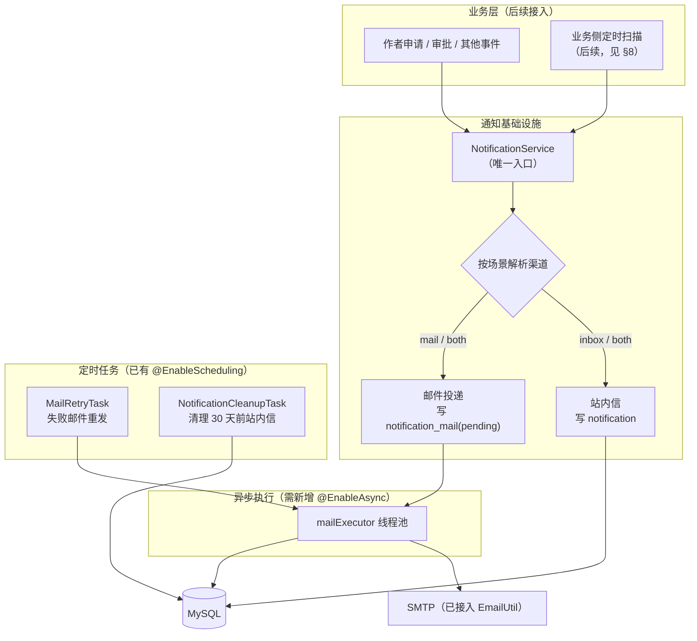
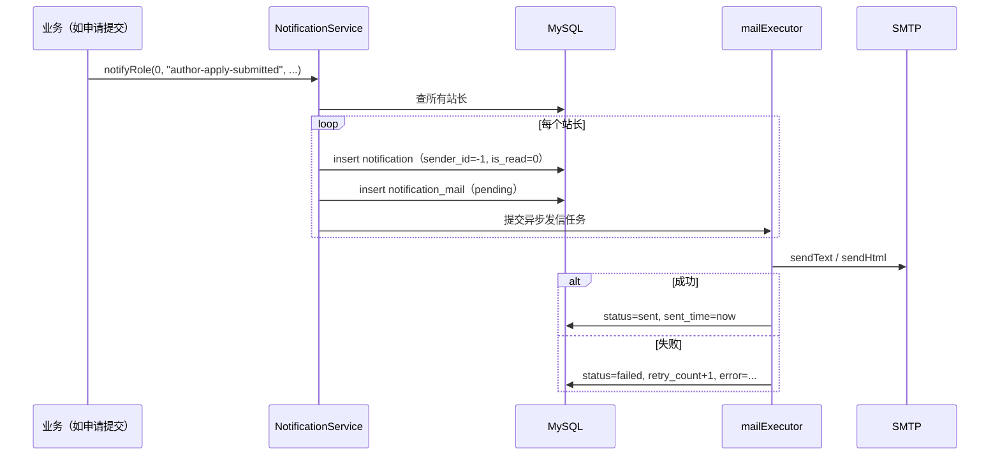

# 站内通知与邮件基础设施 · 详细设计

> 状态：**设计稿 v2（按评审意见简化）** · 归属：`article_trace_back` · 上层业务：作者申请-审批流程

## 版本变更说明（v1 → v2）

| 项 | v1 | v2（本稿） |
|---|---|---|
| 站内信表 | 含 `type` / `biz_type` / `biz_id` / `read_time` | **精简为 7 字段**，新增发送方（支持未来私信） |
| 延时提醒 | 独立 `notification_reminder` 表 + 通用登记/取消 API | **移除**，改由业务侧自行实现 |
| 邮件投递记录 | `notification_mail` | **保留**（按原设计） |

---

## 1. 背景与目标

### 1.1 背景

作者申请-审批流程需要让「事件」触达到「人」：

| 场景 | 触达对象 | 期望渠道 |
|---|---|---|
| 用户提交作者申请 | 站长 | 站内 + 邮件 |
| 审批通过 / 拒绝 | 申请人 | 站内 |
| 申请超 24 小时未处理 | 站长 | 邮件（**本期不实现**，见 §8） |

当前项目只有 `EmailUtil`（能发信），没有站内信、没有投递记录、没有失败重试。若把发信散落在各业务里，会难以追踪、重复造轮子。

### 1.2 目标

提供**与业务解耦**的通知基础设施，解决三件事：

1. **站内信**：统一的消息落库与查询，前端可展示、可标记已读；
2. **邮件投递**：投递落库，失败可重试、可追溯；
3. **渠道可配**：站内 / 邮件 / 两者，按场景配置，改策略不改代码。

### 1.3 范围

- **包含**：站内信表与接口、邮件投递表与重试、`NotificationService`、前端通知中心。
- **不包含**：延时提醒基础设施（改由业务侧实现）、私信功能（本期仅在表结构上预留）、WebSocket 实时推送。

---

## 2. 总体架构



**复用已有**：`EmailUtil`（发信）、`@EnableScheduling`（定时）
**需要新增**：2 张表、`NotificationService`、`NotificationController`、`MailRetryTask`、`NotificationCleanupTask`、`@EnableAsync` + 线程池、前端通知中心

---

## 3. 数据模型

### 3.1 `notification` —— 站内信

```sql
CREATE TABLE `notification` (
  `id`          BIGINT       NOT NULL AUTO_INCREMENT,
  `title`       VARCHAR(120) NOT NULL COMMENT '标题',
  `sender_id`   INT          NULL     COMMENT '发送方：-1 系统消息；用户 id；NULL 表示发送方已注销',
  `receiver_id` INT          NULL     COMMENT '接收方：用户 id；NULL 表示接收方已注销',
  `content`     TEXT         NULL     COMMENT '正文',
  `create_time` DATETIME     NOT NULL COMMENT '发送时间',
  `is_read`     TINYINT(1)   NOT NULL DEFAULT 0 COMMENT '0 未读 / 1 已读',
  PRIMARY KEY (`id`),
  KEY `idx_receiver_read_time` (`receiver_id`, `is_read`, `create_time`)
) ENGINE=InnoDB DEFAULT CHARSET=utf8mb4 COMMENT='站内信';
```

**设计要点**

- **一张表专管站内信**：查询只需按 `receiver_id` 过滤，`idx_receiver_read_time` 同时服务「我的消息分页」和「未读数统计」；
- **一条消息对应一个接收方**：群发（如发给所有站长）= 插入 N 条，各自的已读状态互不影响；
- **不做硬删除**：用户注销时把 `sender_id` / `receiver_id` 置 `NULL`，保留消息本身。

### 3.2 发送方字段语义（`sender_id`）

| 取值 | 含义 | 前端展示 |
|---|---|---|
| `-1` | **系统消息**（本基础设施发出的所有通知） | 「系统通知」 |
| 正整数（用户 id） | 某用户发送（**预留**，供后续私信使用） | 该用户昵称 |
| `NULL` | 发送方已注销 | 「已注销用户」 |

> `receiver_id` 为 `NULL` 表示接收方已注销——消息保留但不再出现在任何人的信箱里。

### 3.3 `notification_mail` —— 邮件投递记录

```sql
CREATE TABLE `notification_mail` (
  `id`          BIGINT       NOT NULL AUTO_INCREMENT,
  `to_email`    VARCHAR(128) NOT NULL COMMENT '收件邮箱',
  `subject`     VARCHAR(200) NOT NULL,
  `content`     TEXT         NULL,
  `status`      VARCHAR(16)  NOT NULL DEFAULT 'pending' COMMENT 'pending / sent / failed',
  `retry_count` INT          NOT NULL DEFAULT 0,
  `error`       VARCHAR(500) NULL     COMMENT '失败原因（截断）',
  `create_time` DATETIME     NOT NULL,
  `sent_time`   DATETIME     NULL,
  PRIMARY KEY (`id`),
  KEY `idx_status_retry` (`status`, `retry_count`)
) ENGINE=InnoDB DEFAULT CHARSET=utf8mb4 COMMENT='邮件投递记录';
```

> **通用表**：不只服务通知——后续的**邮箱验证码**也走它，顺带获得「发信可追溯 + 失败重试」。

---

## 4. 场景与渠道策略

### 4.1 场景标识

场景是**发送时传入的字符串**，用于查渠道配置，**不入库**（站内信表不存类型）：

| 场景 | 含义 | 渠道 |
|---|---|---|
| `author-apply-submitted` | 提交申请 → 站长 | both |
| `author-apply-approved` | 审批通过 → 申请人 | inbox |
| `author-apply-rejected` | 审批拒绝 → 申请人 | inbox |
| `author-apply-remind` | 超时催办 → 站长 | mail |
| `email-code` | 邮箱验证码 | mail |

### 4.2 渠道配置

```yaml
notification:
  scenes:
    author-apply-submitted: both    # 站内 + 邮件
    author-apply-approved: inbox    # 仅站内
    author-apply-rejected: inbox
    author-apply-remind: mail       # 仅邮件
    email-code: mail
  defaultChannel: inbox             # 未配置的场景走此默认
```

渠道取值：`inbox` / `mail` / `both` / `none`。

> 调整投递策略只需改配置，无需改代码。

---

## 5. Service 设计

### 5.1 API

```java
public interface NotificationService {

    /**
     * 给单个用户发通知：按场景解析渠道后投递。
     * 发送方固定为系统（sender_id = -1）。
     *
     * @param receiverId 接收方用户 id
     * @param scene      场景标识（查渠道配置用，不入库）
     */
    void notify(int receiverId, String scene, String title, String content);

    /**
     * 发给某角色的全部用户（逐个 receiver 投递，每人一条站内信）。
     *
     * @param roleType 0 站长 / 1 作者 / 2 读者
     */
    void notifyRole(int roleType, String scene, String title, String content);

    /**
     * 直接发邮件，不产生站内信（用于邮箱验证码等纯邮件场景）。
     */
    void sendMail(String toEmail, String subject, String content);
}
```

### 5.2 实现要点

1. **收件人解析**：`notifyRole` 先按 `roleType` 查出该角色全部用户 id，再逐个走 `notify` 逻辑；
2. **邮件需要邮箱**：站内信只需 `user_id`，发邮件还要邮箱——用户 `email` 为空时**跳过邮件渠道**（只投站内）并记日志；
3. **容错不影响主业务**：方法体 try-catch，失败只记 `log.error`，**不向上抛**（与 `EmailUtil` / `RustFsUtil` 的既有风格一致），避免「通知失败导致申请提交事务回滚」；
4. **不参与主业务事务**：站内信写库用独立事务（`REQUIRES_NEW`），避免一条失败导致业务回滚；
5. **调用方不感知成败**：业务方只发起调用（fire-and-forget），发送结果由基础设施内部捕获、记日志、必要时重试；**不向调用方返回发送状态**，发信失败也不影响业务。

### 5.3 即时投递流程



---

## 6. HTTP 接口

| 方法 | 路径 | 说明 |
|---|---|---|
| GET | `/notification/list?pageNum=1&pageSize=10` | 我的站内信分页（倒序） |
| GET | `/notification/unreadCount` | 未读数（前端角标） |
| PATCH | `/notification/read/{id}` | 标记单条已读 |
| PATCH | `/notification/readAll` | 全部标记已读 |

- 接收方一律取登录态（`ThreadLocalUtil`），**不接受前端传 `receiverId`**，避免越权读取他人消息；
- 走现有 `TokenCheck` 鉴权（**不要**加入 `excludeUrls`）；
- 分页返回复用 `PageBean`。

---

## 7. 定时任务

| 任务 | 默认 cron | 职责 |
|---|---|---|
| `MailRetryTask` | `0 */10 * * * ?`（每 10 分钟） | 扫描 `status='failed' AND retry_count < maxRetry` 重发；超上限置终态并记告警日志 |
| `NotificationCleanupTask` | `0 0 3 * * ?`（每天凌晨 3 点） | 删除 **30 天前**的站内信（**无论是否已读**） |

> **重试上限为 2 次**（最多重发两次）：QQ 邮箱等 SMTP 有日发信限额，无限重试会打爆额度。任务整体 try-catch，单条失败不影响本轮其它记录。
>
> **清理任务的索引**：现有 `idx_receiver_read_time (receiver_id, is_read, create_time)` 无法支撑 `WHERE create_time < ?` 的删除，需按 `create_time` 单独建索引（或数据量小时直接全表删除）。

---

## 8. 关于「24h 催办」（本期不实现）

「审核提交超过 24 小时提醒站长」**不在本基础设施范围内**，等「作者申请」模块设计时一并实现。

### 8.1 为什么不做进基础设施

判断「有没有该催的审核」，本质是在问「**有没有未处理的申请**」——这依赖**申请表**的状态与时间字段。而该表属于后续的「作者申请」功能：**当前数据库仅有 `user` / `category` / `article` / `comments` 4 张表，申请表尚不存在。**

把催办抽象成通用设施，还需要额外的业务主键、取消逻辑与对账一致性维护；而这些信息其实**业务表自己就有**，放在业务侧最直接。

### 8.2 后续实现形态（待申请表设计后落地）

```java
// 作者申请模块自己的定时任务（届时实现）
@Scheduled(cron = "0 0 * * * ?")   // 每小时
public void remindPendingApply() {
    // 判据是申请表自身：待审批 + 提交超 24 小时
    List<AuthorApply> list = applyMapper.selectPendingOlderThan(24, HOURS);
    if (list.isEmpty()) return;
    notificationService.notifyRole(0, "author-apply-remind",
            "有作者申请待处理", "有 " + list.size() + " 条申请已超过 24 小时未处理");
}
```

> **注意**：上面引用的 `AuthorApply` / `applyMapper` **目前并不存在**，仅为说明「催办由业务侧实现」的形态；具体数据模型待作者申请功能设计时确定。
>
> 催办频率控制（如「每天最多催一次」）所需的字段（如 `last_remind_at`）届时加在**申请表**上——状态跟着业务走，通知表保持精简。

---

## 9. 异步与线程池

项目当前**没有** `@EnableAsync`，需新增：

```java
@Configuration
@EnableAsync
public class AsyncConfig {
    @Bean("mailExecutor")
    public ThreadPoolTaskExecutor mailExecutor() {
        ThreadPoolTaskExecutor executor = new ThreadPoolTaskExecutor();
        executor.setCorePoolSize(2);
        executor.setMaxPoolSize(4);
        executor.setQueueCapacity(100);
        executor.setThreadNamePrefix("mail-");
        // 队列满时由调用线程执行：不丢任务；即使丢了，notification_mail 的重试任务也能补
        executor.setRejectedExecutionHandler(new ThreadPoolExecutor.CallerRunsPolicy());
        executor.initialize();
        return executor;
    }
}
```

发信方法标注 `@Async("mailExecutor")`。

> **不用** Spring 默认的 `SimpleAsyncTaskExecutor`——它每次调用新建线程，无池化无上限。

---

## 10. 配置汇总

```yaml
spring:
  mail:
    host: ${MAIL_HOST:smtp.qq.com}
    port: ${MAIL_PORT:465}
    username: ${MAIL_USERNAME}
    password: ${MAIL_PASSWORD}      # 授权码
notification:
  scenes:                           # 场景 → 渠道
    author-apply-submitted: both
    author-apply-approved: inbox
    author-apply-rejected: inbox
    author-apply-remind: mail
    email-code: mail
  defaultChannel: inbox
  mail:
    enabled: true                   # 邮件渠道总开关（关掉后只投站内）
    maxRetry: 2                     # 最多重发两次
    retryCron: "0 */10 * * * ?"
  cleanup:
    cron: "0 0 3 * * ?"             # 每天凌晨清理
    keepDays: 30                    # 站内信保留天数
```

> `notification.mail.enabled=false` 时，所有 `mail` / `both` 场景自动降级为仅站内——可作为发信故障时的应急开关。
>
> `cleanup.keepDays` 控制站内信保留期：超期记录**无论是否已读**都会被清除。

---

## 11. 前端设计

| 项 | 设计 |
|---|---|
| 入口 | `UserLayout.vue` 加**铃铛图标 + 未读角标** |
| 列表 | `el-drawer` 抽屉，倒序展示 |
| 发送方展示 | `sender_id = -1` → 「系统通知」；`NULL` → 「已注销用户」；其它 → 昵称 |
| 点击 | 标记已读（**仅展示内容，不做业务跳转**）|
| 拉取 | 进入用户中心拉一次 `unreadCount`；打开抽屉拉 `list` |
| 接口封装 | 新增 `api/notification.js` |

> 未读数**不做高频轮询**（60s 以上或仅进入页面拉取），避免无谓请求。

---

## 12. 分期实施

| 阶段 | 内容 | 可验证结果 |
|---|---|---|
| **P1** | 2 张表 + 实体/Mapper + `NotificationService`（站内信）+ `NotificationController` + 前端铃铛/列表 | 手动插入一条站内信，前端可见并可标记已读 |
| **P2** | 邮件投递落库 + `@EnableAsync` 线程池 + `MailRetryTask` | 通知能发邮件；断网后失败邮件能自动重发 |
| **P3** | 接入作者申请业务（申请提交 / 审批 / 业务侧催办） | 完整闭环 |

---

## 13. 设计决策记录

### 已决事项

| 项 | 决定 |
|---|---|
| 发信结果反馈 | 主逻辑只向邮件工具发起调用；**发送成败由邮件工具内部捕获并记日志**，调用方不感知 |
| 重试上限 | **2 次**（最多重发两次）|
| 站内信保留 | 每天凌晨自动清理 **30 天前**的记录（**无论是否已读**）|
| 业务跳转 | 本期**不做**——前端仅展示通知内容，不跳转到对应业务（故不设 `biz_type`/`biz_id`）|
| 验证码存储 | **Redis 暂存**（邮件发送成功后再写入，避免发信失败却占用验证码与限流）；投递记录**复用** `notification_mail` |
| 私信 | 本期不实现（`sender_id` 字段已预留语义）|
| 群发性能 | 站长规模小，暂不优化 |

### 风险

| 风险 | 缓解 |
|---|---|
| 通知失败影响主业务 | 全程 try-catch + 独立事务；调用方不感知 |
| 邮件配额（QQ 邮箱日限额）| 重试上限 2 次 + 失败告警 + `mail.enabled` 总开关 |
| `notification` 表累积 | `NotificationCleanupTask` 每天清理 30 天前记录 |
| 清理语句索引 | 需补 `create_time` 索引（见 §7）|

### 仍待决

1. **验证码细节**（位数、有效期、发送频率限制、Redis key 设计）——属于「邮箱验证码」功能设计时的内容，不在本基础设施范围；
2. **清理分批**：当前规模一次性 `DELETE` 即可；若将来单次删除量过大，再改分批。

---

## 附：与现有代码的衔接点

| 现有资产 | 衔接方式 |
|---|---|
| `EmailUtil` | 邮件渠道直接复用，不改造 |
| `@EnableScheduling` | `MailRetryTask` 沿用 |
| `PageBean` | `/notification/list` 复用 |
| `TokenCheck` | 通知接口默认受鉴权保护，无需改配置 |
| `article_trace.sql` | 新增 2 张表的 DDL 追加于此文件 |
| `UserServiceImpl.deleteUser` | 注销用户时需把其 `sender_id` / `receiver_id` 置 `NULL`（见 §3.1） |
